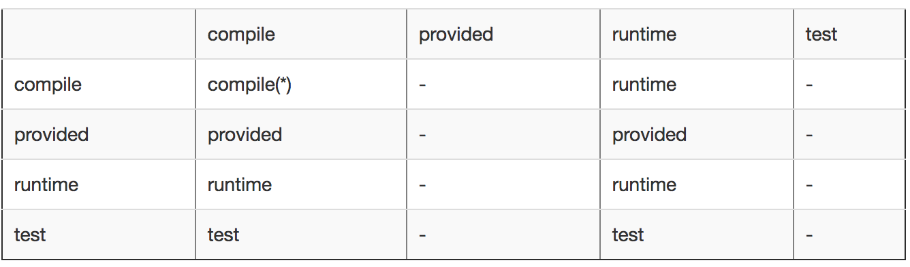

----------
## 技术文档编写指南

学习文档：
* 是什么? & 核心思想、设计哲学 & 理论抽象。
* 解决了什么问题，怎么解决的。之前或者同类型的工具/方案有什么？
* 实践。
* 总结。

每一部分都要以概念开始。以点带面。
针对学习文档，注意关注guideline，best practice和design pattern。最好以XX + 前面那三个单词去检索。

设计文档：
* 背景或者问题。注意背景、问题和目标和特性呼应。
* 目标和特性。以一句话概况设计的应用组件的核心功能。
* 设计哲学。
* 详细方案。首先整体架构图或者流程图，其次按照模块展开。
* 细节展开。如果需要对详细方案的补充在这部分。
* 参考文档。

每一部分仍然以核心概念开始，如果核心概念比较详细，那么写在这部分的开头，如果核心概念描述简单，那么直接作为标题。

使用文档:

## 1 Maven

#### 1.1 Maven是什么？

Maven是服务Java开发的 **构建** 和 **项目管理** 工具。

**构建**

包含编译、测试、打包、部署等等一系列开发流程。

**项目管理**

包含：
* 基于pom的依赖管理。
* 项目文档、项目描述、测试报告等信息管理。
* 基于中央仓库的jar包管理。

#### 1.2 Maven哲学

Maven的哲学是 「约定优于配置」，就像[Philosophy of Maven](https://maven.apache.org/background/philosophy-of-maven.html)中提到的，通过这种设计哲学，最终实现：

> visibility, reusability, maintainability, and comprehensibility

的目标。

#### 1.3 为什么要用Maven?

Make、Ant是Maven出现之前被广泛应用的构建工具，但是：
* Makefile脚本是Make的描述文件，但是Makefile经常被抱怨对语法和格式不友好；
* Ant和Make一样是过程式的，而Maven是声明式的，引入大部分已经实现好的插件，有固定的生命周期绑定。

从另一方面说，Maven也是伴随着Java生态的繁荣而拥有较大的受众。

## 2 Maven 实践

### 2.1 settings.xml

安装中除了配置MAVEN_HOME比较关键的就是settings.xml的配置，.m2下的setting.xml用来配置Jar/Plugin仓库、server账号密码、镜像等等。详细的配置项可以参考：https://maven.apache.org/settings.html

### 2.2 依赖管理

概念：
* 坐标。
* pom - Project Object Model

除了build的自动化，Maven的另一个强大功能是依赖管理，依赖通过坐标方式在pom.xml中手动配置引入。所谓坐标，就是作为项目唯一标识的一组gruopId/artifactId/version的标签集合。

**(1) 依赖范围 & 依赖传递**

依赖范围是指引入依赖的生效classpath，其中classpath包含：1. 编译classpath。2.测试classpath。3.运行classpath。

其中compile在三种classpath都生效。test仅在测试claspath有效。provided仅在编译和测试classpath有效。runtime只在测试和运行classpath有效。

依赖范围：
* compile(编译范围)(例子：spring-core)。compile 是默认的范围;如果没有 供一个范围，那该依赖的范围就是编译范围。编译范围依赖在所有的 classpath 中可用，同时它们也会被打包。
* provided(已提供范围)(例子：servlet-api，其又容器提供)。Provided 依赖只有在当 JDK 或者一个容器已提供该依赖之后才使用。它不是传递性的，也不会被打包。
* runtime(运行时范围)（例子：JDBC）。runtime 依赖在运行和测试系统的时候需要，但在编译的时候不需要。比如， 你可能在编译的时候只需要JDBCAPIJAR，而只有在运行的时候才需要JDBC 驱动实现。
* test(测试范围)。test 范围依赖 在一般的 编译和运行时都不需要，它们只有在测试编译和测试运行阶段可用。
* system(系统范围)，system 范围依赖与 provided 类似，但是你必须显式的 供一个对于本地系统 中 JAR 文件的路径。这么做是为了允许基于本地对象编译，而这些对象是系统 类库的一部分。这样的构件应该是一直可用的，Maven 也不会在仓库中去寻找 它。如果你将一个依赖范围设置成系统范围，你必须同时 供一个 systemPath 元素。注意该范围是不推荐使用的(你应该一直尽量去从公共或定制的 Maven 仓库中引用依赖)。

依赖传递：
依赖传递是福也是祸，这种机制大大方便了传递性依赖引入的问题，如A->B->C，其中A并不用关心B的依赖，Maven会替你做这件事。但是带来的问题是无穷无尽的依赖冲突问题。

其中依赖范围会影响依赖的传递，如下：

**（2）可选依赖(optional)**

optional解决也是依赖传递的问题，如：A->B，B->C（optional），当C声明为optional时对B无影响，只不过A不会引入C，如果C对于A是必须的，需要手动引入。

stackoverflow(https://stackoverflow.com/questions/40393098/when-to-use-optionaltrue-optional-and-when-to-use-scopeprovided-scope) 上有对 optional 和 provided 区别的讨论。不过从根本上来讲，二者表达的不是同一类问题，optional关注的只是传递性依赖的问题，而 provided 更多关注的是当前依赖的有效范围的问题（在哪个classpath有效），在此基础上也要解决这种scope传递的问题。

**（3）依赖解析 **

概念：
* 依赖路径。依赖路径是指依赖传递的关系，如A依赖B,B依赖C,那么依赖路径为：A->B->C。
* Maven决定依赖的两原则：i)第一原则：路径最近优先。ii)第二原则：第一声明优先。首先使用第一原则确定最终依赖，如果无法确定，使用第二原则。（注意：第二原则在Maven2.0.9开始才生效。）

两种情景：
* A->B->C->X(1.0) 和 A->D->X(2.0)。根据路径优先原则，最终的依赖为X(2.0)。
* A->B->X(1.0) 和 A->D->X(2.0)。根据第一声明优先，如果在pom中前者在后者之前`声明`，那么最终依赖为X(1.0)。

### 2.3 生命周期与插件

概念：
* 生命周期。申明周期是对构建过程的抽象。
* Phase。Phase是对生命周期的细化。
* 插件Goal。Goal是Phase这种生命周期抽象的实现，Goal与Phase绑定。

Maven拥有相互独立的三套生命周期，分别是 clean、default、site。

其中default的Phase较多，如下是其中一部分阶段以及阶段与插件Goal的绑定。需要注意的是，生命周期是独立的，但是单独生命周期的Phase是后面包含前面的。如install的执行通常也意味着package也会执行。

### 2.4 聚合&继承

概念：
* 聚合：为了一次构建多个项目，通过<models>标签将多个模块聚合起来，在聚合模块执行maven命令会逐个遍历<models>标签下的模块执行命令。
* 继承：为了消除重复配置&统一管理配置。将公共配置提取到父模块中，在子模块通过<parent>指定父模块，就可以共享parent中的配置。

在继承中，有一个重要的概念是依赖管理，通过<dependencyManagement>标签统一管理各个模块的依赖版本，达到全项目依赖版本统一的目的。同样针对插件管理，在<build>下也存在<pluginManagement>做同样的事情。

如果继承了parent的pom，那么从parent继承到的信息包含：
* 定义符(groupId 和 artifactId 中至少有一个必须被覆盖)
* 依赖
* 开发者和贡献者
* 插件列表
* 报告列表
* 插件执行 (id 匹配的执行会被合并)
* 插件配置
* ...

## 3 进一步谈maven依赖机制

### 3.1 传递性依赖

maven从2.0开始支持传递性依赖特性，希望解决的是传递性依赖「自动引入的问题」：

> This allows you to avoid needing to discover and specify the libraries that your own dependencies require, and including them automatically.

因为传递性依赖会造成项目依赖的爆炸性增长，所以maven存在一些额外的特性用来对依赖进行约束和限制：

* 依赖调解（dependecy mediation）。这个基本比较明确，两个原则，「路径深度优先」，如果不足以进行决定，那么「声明顺序优先」。
* 依赖管理（dependency management）。Dependency Management是集中管理依赖信息的一种机制。依赖管理是「directly specify the versions」
    * in transitive dependencies （注意只针对传递性依赖）（针对于非公共依赖，如果在dependency management中定义，是为了显式指定版本）
    * in dependencies where no version has been specified （解决多模块项目公共依赖的问题）

* 依赖范围（dependency scope）。
* 依赖排除（exclude dependencies）。
* Optional依赖。（optional dependencies）。

### 3.2 依赖确定机制

原则 & 优先级：

* 优先级：dependency mediation 路径深度优先 > 声明顺序优先。声明顺序优先对于dependency management同样适用（对于import scope导入的pom）。
* 针对 __传递性依赖__，在以上优先级的基础上，如果在 dependencyManagement 中指定了版本，那么会使用指定的版本。

更详细的可以看下[官方文档](http://maven.apache.org/guides/introduction/introduction-to-dependency-mechanism.html#Dependency_Management)，里面的例子很清晰。

## End - 几个命令

* 使用 dependency:analyze 分析间接引用的依赖
* 使用 dependency:tree 分析依赖树
* 使用mvn help:effective-pom分析真正的pom依赖是什么
