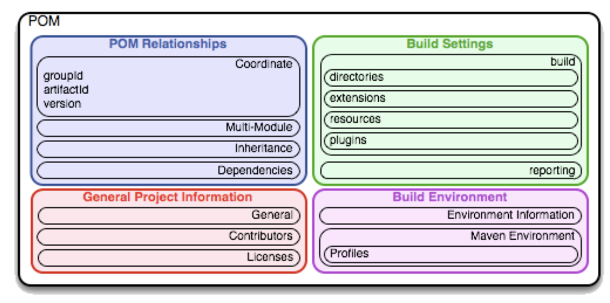

## 1 Maven About

Maven的哲学是 「约定优于配置」，就像[Philosophy of Maven](https://maven.apache.org/background/philosophy-of-maven.html)中提到的，通过这种设计哲学，最终实现：

> visibility, reusability, maintainability, and comprehensibility

的目标。


## 2 Maven 实践

### 2.1 Maven 核心概念

**(1)插件与目标**

插件与目标的定义形式为 `pluginId:goalId`，以 `mvn archetype:create -DgroupId=com.sankuai.hotel -DartifactId=hotel-order` 为例，插件archetype的目标是create操作，用于创建项目的原型骨架，而-D用于指定操作的参数。

**(2)生命周期**

Maven的生命周期一般简单的分为validation、test、deployment三个阶段，更详细一些，一般可以细化为：
process resources -> compile -> process classes -> process test resources -> test compile -> test -> prepare package -> package等，而每一个阶段都默认绑定了插件与目标操作，用来完成每个阶段的功能。并且默认来讲后一个阶段总会顺序的执行它之前的所有阶段，除非通过一定的方式排除掉。举个例子，mvn package 会执行它之前的所有阶段，但是如果你通过 -Dskip.test这种方式排除掉test阶段的话，那么也就排除了test阶段绑定的插件与目标的执行。


**(3)项目坐标与仓库**

groupId, artifactId, version 用来唯一标识一个项目(jar,pom)的坐标。
这个坐标同样被应用到了本地与远程仓库的项目位置标识上，如 org.apache.commons:commons-email:1.1 在maven仓库的位置为： /org/apache/commons/commons-email/1.1/

**(4)pom.xml**

Maven 使用pom.xml文件描述依赖、构建设置、构建环境等信息



**(5)依赖范围**
* compile(编译范围)
compile 是默认的范围;如果没有 供一个范围，那该依赖的范围就是编译范围。编译范围依赖在所有的 classpath 中可用，同时它们也会被打包。
* provided(已提供范围)，provided 依赖只有在当 JDK 或者一个容器已提供该依赖之后才使用。它不是传递性的，也不会被打包。
* runtime(运行时范围)
runtime 依赖在运行和测试系统的时候需要，但在编译的时候不需要。比如， 你可能在编译的时候只需要JDBCAPIJAR，而只有在运行的时候才需要JDBC 驱动实现。
* test(测试范围)。test 范围依赖 在一般的 编译和运行时都不需要，它们只有在测试编译和测试运行阶段可用。
* system(系统范围)，system 范围依赖与 provided 类似，但是你必须显式的 供一个对于本地系统 中 JAR 文件的路径。这么做是为了允许基于本地对象编译，而这些对象是系统 类库的一部分。这样的构件应该是一直可用的，Maven 也不会在仓库中去寻找 它。如果你将一个依赖范围设置成系统范围，你必须同时 供一个 systemPath 元素。注意该范围是不推荐使用的(你应该一直尽量去从公共或定制的 Maven 仓库中引用依赖)。

**(6)依赖传递**
如果a依赖了b，b依赖了c，那么c即为a的传递性依赖。

**(7)项目继承**
如果通过

```java
<parent>
    <groupId>com.parent</groupId>
    <artifactId>parent</artifactId>
    <version>1.0-SNAPSHOT</version>
</parent>
```
的方式继承了parent的pom，那么从parent继承到的信息包含：
* 定义符(groupId 和 artifactId 中至少有一个必须被覆盖)
* 依赖
* 开发者和贡献者
* 插件列表
* 报告列表
* 插件执行 (id 匹配的执行会被合并)
* 插件配置


### 2.2 最佳实践

**(1)使用dependencyManagement进行依赖管理**
**(2)使用mvn dependency分析依赖**
* 使用 dependency:analyze 分析间接引用的依赖
* 使用 dependency:tree 分析依赖树
**(3)使用mvn help:effective-pom分析真正的pom依赖是什么**
**(4)依赖归类**
将统一类别的依赖信息归类，统一提供给使用方，便于这些信息的统一管理与升级，如我司的inf-bom。

**(5)多模块与继承**

一般通过如下非方式进行多模块管理：

```java
<modules>
    <module>module1</module>
    <module>module2</module>
</modules>
```

通过如下的方式指定pom之前的继承关系:

```java
<parent>
    <groupId>com.parent</groupId>
    <artifactId>parent</artifactId>
    <version>1.0-SNAPSHOT</version>
</parent>
```

要注意的是，继承和多模块并没有必然的关系，只有你需要从父pom继承相关信息(见`项目继承`部分)时才需要指定继承关系，否则继承关系可能会起到反作用。

**(6)使用profile或者其它方便的插件如autoconfig管理环境**
