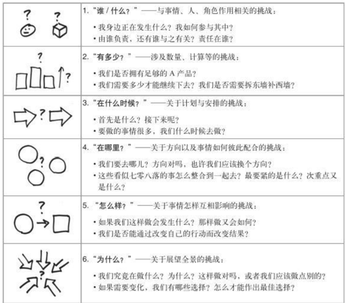
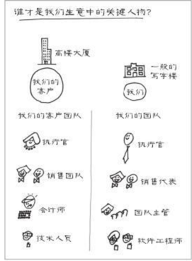
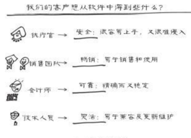
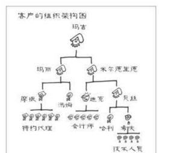
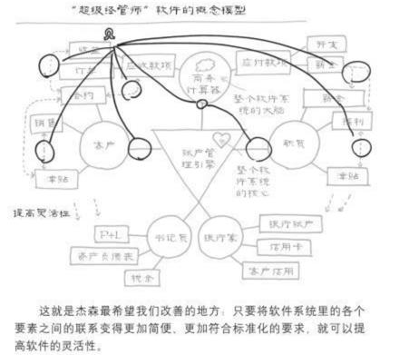

整本书围绕着两个点展开，并以一个例子结尾。

## 两个核心点

* 展示方式：图
* 内容组着：6W法则

## 6W

## 一个例子
#### 案例

> 假设我们正在为一个会计软件公司工作，假设它的名字叫“超级会计软件公司”，或者简单一点，就叫它“SAX 公司”好了。从1996年以来，SAX 公司一直都在设计和销售非常专业的会计软件，它的目标客户都是一些响当当的大公司，其王牌产品一直都稳居行业首位。

> 这个很小的行业领域内，主要有5家公司在竞争，各自都有一套生意经，也都有各自的优势与劣势。这5家公司分别是：
· SAX 公司（也就是我们）
· SM Soft公司
· Peridocs公司
· Univerce公司
· MoneyFree公司
现在的问题是：在过去两年内，SAX 的销售业绩停滞不前，而其他公司的销售额却在持续上升。

> 一年前，SAX 公司推出的最新产品在当时的确有很多亮点，也使他们的软件成为当时最有特色的明星产品，不过现在的情况却是，消费者对它越来越提不起兴趣。SAX 公司的销售代表也抱怨说，在过去的一年里，出现了越来越多的免费软件，这些软件都是开放源代码的，因此想把SAX 公司开发的昂贵的软件卖出去真是越来越难了。免费软件通常由一些软件爱好者开发，因此他们不会有成本的压力，也不会有股东对他们提出要求，而像SAX 公司这样一定规模的企业，这些都是不可想象的。正是因为这些原因，这些免费软件对IT产业产生了越来越大的冲击。虽然迄今为止，还没有哪个开放源代码的免费软件能够接近我们的产品质量，但这种情况应该不会持续太久。我们并不清楚，采取哪些措施才能避免公司的市场份额进一步下滑，但我们知道一定不能坐以待毙

#### 谁才是我们的客户？

#### 客户会买多少？

#### 我们的生意到底在哪里?

#### 我们什么时候解决问题？

#### 我们如何改善经营？

#### 我们何苦如此费心？

