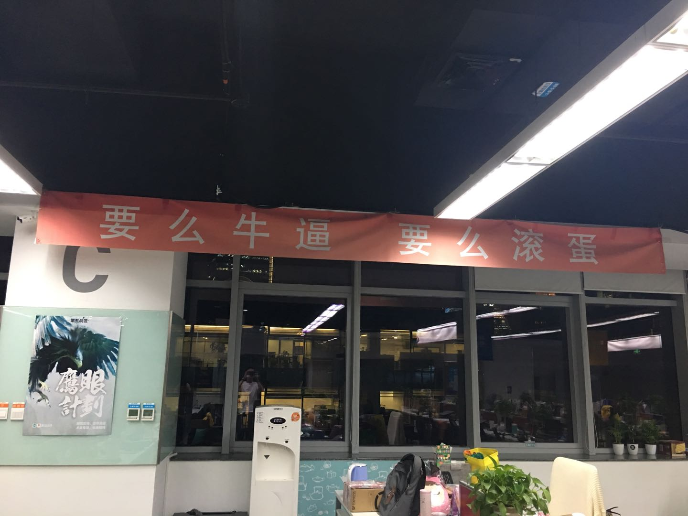

## 2017

17年感觉是特别长的一年，主线仍旧是工作，现在想这一年都干过什么，自己的事能想起来的有限。有句话说，感觉过得快是因为一直在做重复的事，如果真是这样，看来我今年还是有收获的。

从订单团队到后来的switch团队，感觉是去年到今年。做订单的时候不轻松，一来因为时间长了想不出怎么才能不重复，怎么才能做得更好，二来当时完全自己做，有些倦了。后来做switch，也不轻松，主要是细节和方向都要抓，都要想。但是对于「不轻松」这件事，我一直是持欢迎的态度，饭否上一位美团的高管讲「住的了多大的府邸，就得但多大的责任」，用大白话讲就是「住多大的宅子，操多大的心」。

17年在工作上最大的转变是完全又之前的「低头做」转换为了时不时的「抬头看」，带了几位新同学，不轻松，好在都不错。感觉带团队最难的是细节和方向都要把握好，而且细节上的把握是最费精力的，这个有没有解，有，最好的方案就是有靠谱的人。识别靠谱的人很难，招聘不足以看出来，从Q2开始接触社招，以及Q3出去校招积累的经验来讲，如果学校不错、之前的经历可以、人踏实这三个条件满足的话基本都差不多，至少培养起来也轻松。

今年年终时候还有一个感触就是「个人和团队的水平平时是看不出来的，见真刀真枪时才知晓」，好多东西平时多想多积累，多去用现实情境套自己的思路和感受，东北话讲，平时大大咧咧，关键时刻可能就抓瞎。

2017年，看了大概有50-60本书，主要在技术、历史、传记和年初时看的一些畅销或者排行靠前的书。看得越多，也越来越意识到自己在各方面的无知，当然焦虑感也越强。这个也是在工作之外的一个很大的收获。

大概是4月左右，我和丁宇周末发现了摩拜单车，可能我们也是比较靠前的几批用户，当时的感受是贵、难骑。到了11月份，狂热的单车大战已经过去了，该倒闭的都已经倒闭了，太快了。今年又出来一个比较火的事情「得到」，我之前也关注罗振宇的公众号，感觉很扯，每天发一段语音，但是今年光薛兆丰的一门「薛兆丰的北大经济学课」就在上面买了4400万，有些事情的确不是拍脑袋认为的。

今年的关键词：工作、校招、社招、搬家、团队、书、趋势。

## 2018

不设限，不管是在工作上还是其他方面。

做一件事，有积累的。消除焦虑感。

锻炼。心还没老人老了。

阅读，找到目标，模仿、实践（刻意练习）。

[徐小平：关于那些最终将影响人生格局的问题清单](http://mp.weixin.qq.com/s/7QtuVkPrPo6Vc66_9zQr1w)
