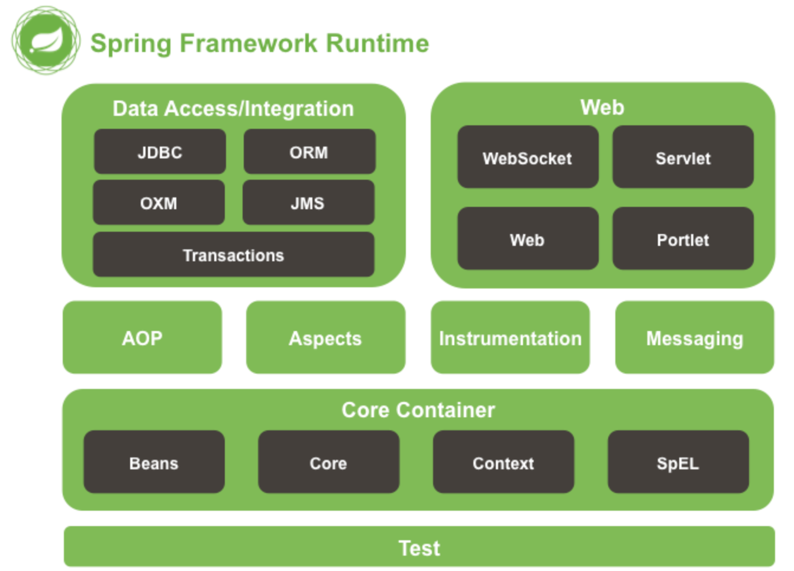

* 目录
{:toc}

# 1 Spring

Spring 当前的概念已经不仅仅局限在构建 Java Application 使用的 Spring Framework，还包含一系列针对构建、分布式等领域的衍生品，如 Spring Boot、Spring Clould等等。


详细可见 [Spring IO](https://spring.io/)

不详细说上面的技术点，这里只简单梳理最经典的 Spring Framework 部分。

# 2 Spring Framework 基础概念

Spring Framework 包含 Spring 核心容器，Web，AOP 等大概20个模块，这些模块通过 spring-core/spring-context/spring-context-support 等 jar 的形式引用到开发应用中，提供依赖管理、AOP支持、Web开发支持等功能。




## 2.1 历史

Spring 是 Rod Johnson 致力于简化企业级 Java 开发而发起的开源项目，通过 Spring 可以使用简单的 JavaBean 完成之前需要通过复杂的 EJB 编程方式才能做到的事务管理等等功能。为了证明这一点，Rod Johnson 专门写了 [一对一教程](https://book.douban.com/subject/1436131) 来讲解 Spring 是怎样做到的。


哲学与策略：

* 基于 POJO 实现无侵入式编程。（主要针对 EJB 而言）（如Bean的依赖管理对非框架代码完全是无侵入的）
* 通过 `依赖注入` 和 `面向接口` 实现松耦合。
* 基于切面和惯例进行声明式编程。
* 通过切面和模板减少样板式代码。（如 JDBCTemplate）

简单来讲，可以概括为 DI 与 AOP 两个概念的支撑。

## 2.2 容器与依赖注入

### 容器

概念：
* 容器
* Bean 生命周期

Spring Container 指的是 Bean Container，它负责所有托管给 Spring 管理的所有 Bean 的装配，实例，销毁等生命周期流程。Spring Bean 包中的 BeanFactory 是最简单的容器实现，Spring Context 包中的 ApplicatinContext 是基于 BeanFactory 的更复杂的实现，通常称之为上下文。ApplicationContext 的实现包含从 Java 配置类加载上下文的  AnnotationConfigApplicationContext 以及从 XML 文件加载上下文的 ClassPathXmlApplicationContext 等，使用如：

```java
ApplicationContext applicationContext = new AnnotationConfigApplicationContext(Some.class);

applicationContext.getBean("sameBean");
```

容器不但负责组织实例化后的 bean，还负责管理所有 bean 的生命周期，自定义 bean 的创建就是在生命周期的特定阶段做扩展。例如，如果 bean 实现了 Disposable 接口，那么在容器关闭时会调用实现的 distory() 方法。


## 依赖注入

DI 的本质是装配，Spring 提供三种装配机制：

* XML 显式声明。
* JavaConfig 显式声明。
* 自动发现与装配。指的是通过 ComponentScan、Component、AutoWire 或者具有相似功能的注解组合进行 bean 声明与注入。

三种方式可以任意搭配使用，通常来讲，尽可能的使用自动装配，但是这在使用外部依赖或者需要声明外部 bean 时是不可能的，在 JavaConfig 与 XML 两种方式中，JavaConfig 的优势是类型安全。


## 2.3 AOP

关于 AOP，可见 [AOP](https://younghz.github.io/aop)


# 3 Spring MVC


一个 HTTP 请求通过 Web Server 传递给 Spring MVC 框架，在框架内首先交由单例的 「DispatchServlet」，DispatchServlet 根据请求的 URL 通过查找「处理器映射」，确定处理请求的 「Controller」，Controller 处理后返回模型或者视图名（ModleAndView）。DispatchServlet 根据传递视图名给「视图解析器」view resolver，得到真正的「视图实现」，视图实现根据数据输出最终的响应。

其中 「处理器映射」和 「视图解析器」也是 MVC 解耦的关键所在。

## 3.1 控制器

在正确的配置 MVC 之后，主要的工作就是编写控制器，在控制器使用这里，Spring MVC 提供了很多个性支持。

 1. @Controller 注解声明控制器（其实和 @Component 注解一样，只是希望「词更达意」）。

```java
public @interface Controller {
    @AliasFor(
        annotation = Component.class
    )
    String value() default "";
}
```

 2. @RequestMapping 声明 URL 和类方法映射关系，其中常用参数 value - URL路径；method - HTTP请求类型。
 3. @RequestMapping 声明的方法返回值表达视图名称，如 `return "home"`。

```java
@RequestMapping("/hello")
	public String sayHello() {
		return "hello";
}
```

 4. MockMvc 支持更完备的 Controller 测试。
 5. 传递数据给视图。

```java
        @RequestMapping("/hello")
		public String sayHello(Model model) {

			// model 会传递给视图
			model.addAttribute("helloKey", "hellValue");

			// 视图名
			return "hello";
		}
```

 6. @RequestParam 注解处理查询参数

```java
		/**
		 * 可以处理 host:port/hello?who=dy 请求
		 * @param name
		 * @return
		 */
		@RequestMapping("/hello")
		public String sayHello(@RequestParam(value = "who", defaultValue = "haizhi") String name,
							   Model model) {

			model.addAttribute("name", name);
			// 视图名
			return "hello";
		}
```

 7. 路径作为参数

```java
		@RequestMapping(value = "/hello/{who}", method = RequestMethod.GET)
		public String sayHello( @PathVariable String who,
							   Model model) {

			model.addAttribute("name", who);
			// 视图名
			return "hello";
		}
```

## 3.2 视图

ViewResolver，即视图解析器的主要工作是接收 viewName 参数，返回实际的 View 实现。Spring 自带了注入 FreeMarkerViewResolver，VelocityViewResolver 等主流的模板的视图解析器。

比如要使用 Thymeleaf 作为视图实现，需要如下配置。

#### 1. 配置视图解析器

```java
		// 定义视图解析器
		@Bean
		public ThymeleafReactiveViewResolver thymeleafViewResolver() {
            ThymeleafReactiveViewResolver resolver = new ThymeleafReactiveViewResolver();

            // 定义 templateEngine() - 模板引擎
            // 模板解析器的关键属性是 模板解析器，在模板解析器中设置资源的 prefix, suffix 等资源路径
            resolver.setTemplateEngine(templateEngine());
            resolver.setOrder(2147483642);
            return resolver;
    
        }


```

#### 2. 在配置的路径定义 viewName.html
#### 3. 在 Controller 中返回 viewName

## 3.3 Spring MVC 中异常处理

针对异常处理，Spring MVC 提供了以下特性支持。

#### 1. @ExceptionHandler 注解处理同一 Controller 下的异常
#### 2. @ControllerAdvice 注解全局拦截异常并处理

## 3.4 Redirect 

## 3.5 Spring Security

Spring Security 作为 Spring MVC 的安全组件，提供 HTTP 访问的安全验证。其最初称为 Acegi Security，但是在最初的版本中需要大量的 XML 配置，Acegi 2.0 修改命名为 Spring Security ，升级的重大内容之一就是简化使用配置。

通过 Java Config 的方式使用 Spring Security 非常简单。整体配置通过继承 `WebSecurityConfigurerAdapter` 并重载三个 config 方法，通过参数 HttpSecurity 配置如何拦截以及拦截哪些请求，通过参数 AuthenticationManagerBuilder 控制验证服务。


## 3.6 Spring & Spring MVC ApplicationContext

几个概念：DispatchServlet、WebApplicationContext、DispatchServlet（Application Context）。

在 https://blog.csdn.net/c289054531/article/details/9196149  中有对三者的说明，简单来说，ServletContext 是针对 Servlet 规范，由 Servlet 容器加载后产生的上下文，这个上下文会包含所有的 Spring/Spring MVC 相关的 ApplicationContext。而 WebApplicationContext 和 DispatchServlet 是父子关系，其中子可以使用父上下文的所有 bean。


正是由于父子之间的个性化 bean 包含关系，所以可能出现由此产生的 bean 注入，aop 等问题，所以针对这种情况建议的方案是所有的 bean 都又父 ApplicationContext加载，在 DispatchServlet 中并不单独的加载 MVC Bean。

针对于问题和详细描述在 http://tech.lede.com/2017/08/15/rd/server/SpringSpringMVCContainerAndAOPCommonMistakes/ 分析的很清晰。

spring boot 使用的是 ServletWebServerApplicationContext ，不针对 MVC 区分 ApplicationContext。
https://docs.spring.io/spring-boot/docs/current/reference/html/boot-features-developing-web-applications.html#boot-features-embedded-container-application-context


