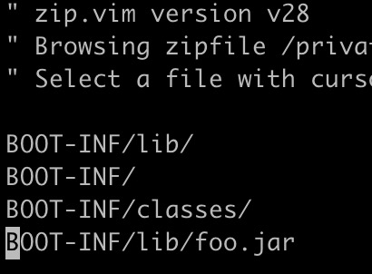
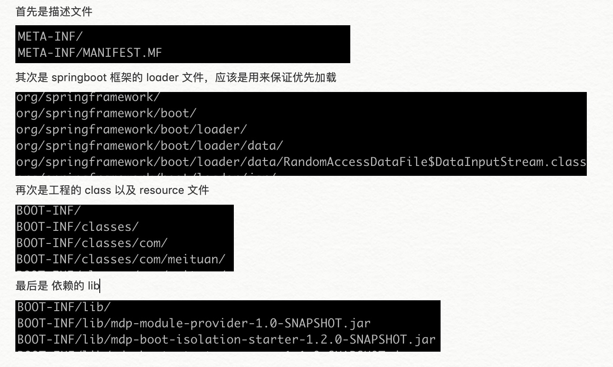

<p style="text-align:center">

</p>

* 目录
{:toc}

当谈起 ClassLoader，首先被想起的是如题图中展示的 ClassLoader 复杂的继承关系及加载策略。其实除此之外，ClassLoader 还包含更丰富的细节。

# 1 ClassLoder


### 1.1 ClassLoader 定义

class loader 负责加载 class。将如 "java.lang.String" 的符合 Java 规范的 「Binary name」（https://docs.oracle.com/javase/8/docs/api/java/lang/ClassLoader.html#name）传给 ClassLoader 的实现类，实现类「定位」并「生成类信息」。这个加载过程中通常使用的加载策略是将传入的 「Binary name」转换为文件名（class file），然后在文件系统中读取这个 class file。

每个 Class 都持有加载它的 ClassLoader 的引用，这个也可从 Class 类的实现代码中发现。

### 1.2 ClassLoder 类

ClassLoader 具体实现可查看 `java.lang` 包下的 ClassLoader 类代码。

### 1.3 ClassLoader 继承关系与查找策略

Java 中的类加载器大致可以分成两类，一类是系统提供的，另外一类则是由 Java 应用开发人员编写的。系统提供的类加载器主要有下面三个：
* 引导类加载器（bootstrap class loader）：它用来加载 Java 的核心库，是用原生代码来实现的，并不继承自 java.lang.ClassLoader。
* 扩展类加载器（extensions class loader）：它用来加载 Java 的扩展库。Java 虚拟机的实现会提供一个扩展库目录。该类加载器在此目录里面查找并加载 Java 类。
* 系统类加载器（system class loader ）：也称为 AppClassLoader。它根据 Java 应用的类路径（CLASSPATH）来加载 Java 类。一般来说，Java 应用的类都是由它来完成加载的。可以通过 ClassLoader.getSystemClassLoader()来获取它。

文章首图展示了上面所述的继承关系。

任何需要定制 ClassLoader 加载行为的都可以实现 ClassLoader 这个类，改变默认的加载行为。ClassLoader默认 加载 「classes」和 「resources」的策略是 「代理模式」，通常也称为双亲委派。ClassLoader 的代理加载策略可见下图。

<p style="text-align:center">

</p>

下面用源码详细说明这种「代理加载策略」的详细实现。以 AppClassLaoder 为例，其实例可见 sun.misc.Launcher ，部分代码如下：

```java
public Launcher() {

	// 1. 实例 ExtClassLoader
    Launcher.ExtClassLoader var1;
    try {
        var1 = Launcher.ExtClassLoader.getExtClassLoader();
    } catch (IOException var10) {
        throw new InternalError("Could not create extension class loader", var10);
    }
    try {
        // 实例 AppClassLoader，并通过参数 var1 设置 parent classLoader 为 ExtClassLoader
        this.loader = Launcher.AppClassLoader.getAppClassLoader(var1);
    } catch (IOException var9) {
        throw new InternalError("Could not create application class loader", var9);
    }
    //...
 }
```

AppClassLoader 并没有重写 Abstract 类 ClassLoader 的 getResource 方法，所以默认实现为如下，也就是先去 parent classLoader 也就是 ExtClassLoader 中加载，加载不到去 「virtual machine's built-in class loader」也就是 「bootstrap class loader」中加载，最后才在自己的 classLoader 中加载。

```java
public URL getResource(String name) {
    URL url;
    if (parent != null) {
        url = parent.getResource(name);
    } else {
        url = getBootstrapResource(name);
    }
    if (url == null) {
        url = findResource(name);
    }
    return url;
}
```

### 1.4 classpath
##### a. classpath 定义

classpath 是 java 运行时搜索 「class」和 「other resource（如 file/image...）」的「路径」。每一个 ClassLoader 都拥有自己的 classpath，作为资深查找资源的路径。


##### b. 怎样设置 classpath

如果不设置，classpath 默认值为当前目录（也就是「.」）， 可以在执行 JDK Tool 时通过 「 -classpath 」或者 「-cp」选项指定，如 

```java
java -classpath classpath1:classpath2...
```
其中 「classpath1:classpath2...」 的值既可以是 .jar .zip 的归档文件，也可以是类似于 「/home/myDirectory」的 directory 路径。


##### c. Class Path 和 Package Names

Java 使用 package 的形式组织类，package 映射到文件系统中的 directory。但是和文件系统中的路径不同的是，package 是不可拆分的整体，举个例子。

在 `utility.myapp` 包下存在 Cool 类，位于文件系统的 C:\java\MyClasses\utility\myapp 下，如果希望运行 Cool，需要通过 `java -classpath C:\java\MyClasses utility.myapp.Cool ` 方式。而通过 `java -classpath C:\java\MyClasses\utility myapp.Cool` 是无法加载到这个类的。

同样，如果 Cool 存在于 jar或者zip 包中，那么加载的方式就变为 `java -classpath C:\java\MyClasses\myclasses.jar utility.myapp.Cool `。

如上策略的一个结果是，两个同样包路径下的同样的类，可以同时存在于两个不同的路径（jar包）中。

##### d. 搜索路径与优先级

可以通过「;」分隔的形式指定多个路径，如 `java -classpath C:\java\MyClasses;C:\java\OtherClasses ... `。其中路径声明的顺序决定了类与资源的查找顺序，按以上方式声明，那么 Java 会首先在 MyClasses 下查找类，如果没有找到需要加载的类，会继续在 OtherClasses 文件夹下查找。

### 1.5 ClassLoder 并行加载

默认 ClassLoader 这个 Abstract 类是支持并行加载的，但是其实现类，如果希望支持并行加载，需要在实例时通过 `ClassLoader.registerAsParallelCapable` 方法指定。如果自定义的 ClassLoader 的加载过程不不是像默认的代理模式这种具有严格层级的，需要将这个 ClassLoader 声明为并行加载的，避免在加载过程重出现死锁（loadClass方法是持有锁的）。

### 1.5 线程上下文类加载器

引用[一篇文章](https://www.ibm.com/developerworks/cn/java/j-lo-classloader/index.html)对上线文类加载器的解释。

> 线程上下文类加载器（context class loader）是从 JDK 1.2 开始引入的。类 java.lang.Thread中的方法 getContextClassLoader()和 setContextClassLoader(ClassLoader cl)用来获取和设置线程的上下文类加载器。如果没有通过 setContextClassLoader(ClassLoader cl)方法进行设置的话，线程将继承其父线程的上下文类加载器。Java 应用运行的初始线程的上下文类加载器是系统类加载器。在线程中运行的代码可以通过此类加载器来加载类和资源。

> 前面提到的类加载器的代理模式并不能解决 Java 应用开发中会遇到的类加载器的全部问题。Java 提供了很多服务提供者接口（Service Provider Interface，SPI），允许第三方为这些接口提供实现。常见的 SPI 有 JDBC、JCE、JNDI、JAXP 和 JBI 等。这些 SPI 的接口由 Java 核心库来提供，如 JAXP 的 SPI 接口定义包含在 javax.xml.parsers包中。这些 SPI 的实现代码很可能是作为 Java 应用所依赖的 jar 包被包含进来，可以通过类路径（CLASSPATH）来找到，如实现了 JAXP SPI 的 Apache Xerces所包含的 jar 包。SPI 接口中的代码经常需要加载具体的实现类。如 JAXP 中的 javax.xml.parsers.DocumentBuilderFactory类中的 newInstance()方法用来生成一个新的 DocumentBuilderFactory的实例。这里的实例的真正的类是继承自 javax.xml.parsers.DocumentBuilderFactory，由 SPI 的实现所提供的。如在 Apache Xerces 中，实现的类是 org.apache.xerces.jaxp.DocumentBuilderFactoryImpl。而问题在于，SPI 的接口是 Java 核心库的一部分，是由引导类加载器来加载的；SPI 实现的 Java 类一般是由系统类加载器来加载的。引导类加载器是无法找到 SPI 的实现类的，因为它只加载 Java 的核心库。它也不能代理给系统类加载器，因为它是系统类加载器的祖先类加载器。也就是说，类加载器的代理模式无法解决这个问题。

> 线程上下文类加载器正好解决了这个问题。如果不做任何的设置，Java 应用的线程的上下文类加载器默认就是系统上下文类加载器。在 SPI 接口的代码中使用线程上下文类加载器，就可以成功的加载到 SPI 实现的类。线程上下文类加载器在很多 SPI 的实现中都会用到。


# 2 Spring 资源加载与 ClassLoader
### 2.1 Spring 对 resource 加载的封装

Spring 对 resource 加载做了封装，使用自身的 ResourceLoader 进行加载，ResourceLoader 根据资源不同形式将其封装为不同的 Resource实现，但是最终的资源加载仍然使用底层的 ClassLoader。这部分的内容可见[这篇文章](https://www.ibm.com/developerworks/cn/java/j-lo-spring-resource/index.html)。

### 2.2 从 Spring 启动代码详解 ClassLoader

##### a. SpringBoot 应用启动入口

当通过 java -jar 启动 jar包时，启动入口为 MANIFEST.MF 描述文件中的 Main-Class 字段，如下为 SpringBoot FatJar 的描述文件。可见启动入口为 JarLauncher 中的 main 方法。

```
Manifest-Version: 1.0
Built-By: yanghaizhi
Start-Class: com.meituan.mdp.module.run.Application
Spring-Boot-Classes: BOOT-INF/classes/
Spring-Boot-Lib: BOOT-INF/lib/
Spring-Boot-Version: 2.0.6.RELEASE
Created-By: Apache Maven 3.5.2
Build-Jdk: 1.8.0_60
Main-Class: org.springframework.boot.loader.JarLauncher
```

##### b. SpringBoot JarLauncher

JarLauncher 代码存在于 spring-boot 工程的 `spring-boot-tools` 下的 `spring-boot-loader` 中，其main方法如下

```java
public static void main(String[] args) throws Exception {
		new JarLauncher().launch(args);
	}
```

##### b. ClassPath 获取

上面 launch 方法内容如下，其中比较关键的代码为获取 classPath 的 getClassPathArchives方法，  从以下代码中可以发现，符合两种条件的 路径 构成了 classpath：

* BOOT-INF/classes/ 路径
* BOOT-INF/lib/ 下的 每个Jar

```java
// 代码片段1	
protected void launch(String[] args) throws Exception {
		JarFile.registerUrlProtocolHandler();
    
    // 创建 classLoader，其中 getClassPathArchives() 为获取 classPath 的方法
		ClassLoader classLoader = createClassLoader(getClassPathArchives());
		launch(args, getMainClass(), classLoader);
	}

// 代码片段2
/**
* 从以下代码中可以发现，符合两种条件的 路径 构成了 classpath
* 1. BOOT-INF/classes/ 路径
* 2. BOOT-INF/lib/ 下的 Jar
* 
*/
@Override
protected List<Archive> getClassPathArchives() throws Exception {
	List<Archive> archives = new ArrayList<>(
			this.archive.getNestedArchives(this::isNestedArchive));
	postProcessClassPathArchives(archives);
	return archives;
}

// 代码片段3
@Override
public List<Archive> getNestedArchives(EntryFilter filter) throws IOException {
	List<Archive> nestedArchives = new ArrayList<>();
   // 这个类实现了 iterator 接口，这里的 this 实际上是调用下方的 iterator 方法（代码片段4），也就是
   // 遍历 jarFile(也就是 spring boot fat jar，也就是 spring boot plugin 插件 repacke生成的 jar包) 的 entries
   // 注意！！！！！！  jarFile 的 entries 是「有序的」，这个顺序是生成 Jar 的时候的写入 entry 的顺序，关于这里详细
   // 描述见下方文字。
	for (Entry entry : this) {
		if (filter.matches(entry)) {
			nestedArchives.add(getNestedArchive(entry));
		}
	}
	return Collections.unmodifiableList(nestedArchives);
}

// 代码片段4
/**
* 这个类实现了 iterator 接口
*/
@Override
public Iterator<Entry> iterator() {
	return new EntryIterator(this.jarFile.entries());
}

 // 代码片段5
static final String BOOT_INF_CLASSES = "BOOT-INF/classes/";
static final String BOOT_INF_LIB = "BOOT-INF/lib/";

@Override
protected boolean isNestedArchive(Archive.Entry entry) {
	if (entry.isDirectory()) {
		return entry.getName().equals(BOOT_INF_CLASSES);
	}
	return entry.getName().startsWith(BOOT_INF_LIB);
}
```

关于上面「代码片段3」中所说的 jarFile 的 entries 是有序的，且顺序为 entry 写入顺序问题，可以通过 vi 这个 jar包确认。SpringBoot 的测试类 `JarLauncherTests` 中，有生成 jarFile 的工具类，可以修改代码调整 entry 的写入顺序，下面是两种调整前后的对生成 jar 包 vi 的结果。

<p style="text-align:center">

</p>
<p style="text-align:center">

</p>

从 spring boot 生成的 FatJar 的 vi 结果看，其 Entry 顺序如下。

<p style="text-align:center">

</p>

classpath 结论：

BOOT-INF/classes/ 路径 和 BOOT-INF/lib/ 下的 Jar 构成了 classpath，顺序为 classes 优先，lib（lib下的每个Jar都是一个单独的URL）更低。这个优先级在创建classLoader的时候会用到。见下方分析。

##### c. 创建 LaunchedURLClassLoader

我们关注 classLoader 创建的代码，如下。

```java
/**
* 这个参数 List 有序，其顺序如上所述
*/
protected ClassLoader createClassLoader(List<Archive> archives) throws Exception {
	List<URL> urls = new ArrayList<>(archives.size());
	for (Archive archive : archives) {
		urls.add(archive.getUrl());
	}
	return createClassLoader(urls.toArray(new URL[0]));
}

/**
* LaunchedURLClassLoader 使用有序的 URL 数组创建 classLoader
* LaunchedURLClassLoader 的父类为 URLClassLoader, 上面的 URL[] 直接传递给父类构造器
*/
protected ClassLoader createClassLoader(URL[] urls) throws Exception {
	return new LaunchedURLClassLoader(urls, getClass().getClassLoader());
}

/**
 * URLClassLoader 的构造器如下。使用 URLs 创建 URLClassLoader。在搜索 classes
 * 和 resources 时候，URLClassLoader 使用的是 ClassLoader 的默认实现，也就是
 * 逐层委托父 classLoader 查找后，查找不到后，开始查找自己。而查找自己的顺序为 URLs
 * 这个数组的顺序，按照这个顺序不断向下查找。
 */
public URLClassLoader(URL[] urls, ClassLoader parent) {
    super(parent);
    // this is to make the stack depth consistent with 1.1
    SecurityManager security = System.getSecurityManager();
    if (security != null) {
        security.checkCreateClassLoader();
    }
    ucp = new URLClassPath(urls);
    this.acc = AccessController.getContext();
}
```

##### d. 进一步说 URLClassLoader 查找资源与类

URLClassLoader 类注释：

> 
> * This class loader is used to load classes and resources from a search
> * path of URLs referring to both JAR files and directories. Any URL that
> * ends with a '/' is assumed to refer to a directory. Otherwise, the URL
> * is assumed to refer to a JAR file which will be opened as needed.

像 URLClassLoader 类注释说的一样，URLClassLoader 是用来在指定的 URLs（可能是 Jar 或者 directory）搜索 class 和 resource 的工具。如果 URL 以 '/' 结尾就默认为 directory，否则会被认为是一个 JAR 文件。进一步，以为 URLClassLoader 实际的查找是委托给 URLClassPath 的，如果是 directory，URLClassPath 在查找资源时会用 FileLoader 查找，如果是 Jar 文件，那么用 JarLoader 查找。

下面用 URLClassLoader 的代码来说明 resource 和 class 的加载过程。

##### e. URLClassLoader findResource

URLClassLoader 的所有查找操作其实都委托给 URLClassPath，URLClassPath 是在创建 URLClassLoader时根据参数 URL[] 构建。

```java
public URL findResource(final String name) {
    /*
     * The same restriction to finding classes applies to resources
     */
    URL url = AccessController.doPrivileged(
        new PrivilegedAction<URL>() {
            public URL run() {
                return ucp.findResource(name, true);
            }
        }, acc);
    return url != null ? ucp.checkURL(url) : null;
}
```

URLClassPath 的 findResource 方法

```java
// 代码片段1
public URLClassPath(URL[] var1, URLStreamHandlerFactory var2) {
    this.path = new ArrayList();
    this.urls = new Stack();
    // 实际的加载 class 或者 resource 文件的实现
    // URL[] 中的每一个 URL 都对应实例一个 URLClassPath.Loader ，并且顺序和 参数 URL[] 顺序一致
    // URLClassPath.Loader 使用 URL 作为查找的 basePath
    this.loaders = new ArrayList();
    this.lmap = new HashMap();
    this.closed = false;
    for(int var3 = 0; var3 < var1.length; ++var3) {
        this.path.add(var1[var3]);
    }
    this.push(var1);
    if (var2 != null) {
        this.jarHandler = var2.createURLStreamHandler("jar");
    }
}    

// 代码片段2
public URL findResource(String var1, boolean var2) {
    int[] var4 = this.getLookupCache(var1);
    URLClassPath.Loader var3;
    // 之前所述的 URLClassLoader 按照实例时传递的 URLs 的顺序搜索资源的功能由这里保证
    // 由于 所有 URLClassPath.Loader  的顺序和 URL[] 一致，所以循环遍历查找时的循环顺序即是按照 URL[] 的顺序查找
    // 当两个路径下存在相同的resource 时，会优先返回靠前 url 的资源
    for(int var5 = 0; (var3 = this.getNextLoader(var4, var5)) != null; ++var5) {
        // 如果 URLClassPath.Loader 的实现为 JarLoader ，findResource 其实就是调用 jar.getJarEntry 方法查找 resource
        URL var6 = var3.findResource(var1, var2);
        if (var6 != null) {
            return var6;
        }
    }
    return null;
}
```

##### f. URLClassLoader findResources

通常 URLClassLoader 的 findResources 委托给 URLClassPath 的 findResources。

逻辑为在所有 URLs 列表中遍历查找包含 resource 的 url，并返回。

```java
/**
* 其返回值为 Enumeration 的实例
* 遍历 index 拿到所有的 URLClassPath.Loader ，并不断遍历查找所有包含 resource 的 URL
*/ 
public Enumeration<URL> findResources(final String var1, final boolean var2) {
    return new Enumeration<URL>() {
        private int index = 0;
        private int[] cache = URLClassPath.this.getLookupCache(var1);
        private URL url = null;
        private boolean next() {
            if (this.url != null) {
                return true;
            } else {
               // 不断遍历查找下一个包含属性的 URL
                do {
                    URLClassPath.Loader var1x;
                    if ((var1x = URLClassPath.this.getNextLoader(this.cache, this.index++)) == null) {
                        return false;
                    }
                    // 这里调用的是 URLClassPath.Loader 的 findResource 方法            
                    this.url = var1x.findResource(var1, var2);
                } while(this.url == null);
                return true;
            }
        }
        public boolean hasMoreElements() {
            return this.next();
        }
        public URL nextElement() {
            if (!this.next()) {
                throw new NoSuchElementException();
            } else {
                URL var1x = this.url;
                this.url = null;
                return var1x;
            }
        }
    };
}
```

##### g. URLClassLoader 的 findClass 

URLClassLoader 继承了 ClassLoader ，其未重写 LoadClass ，代表其默认使用 ClassLoader的委派加载机制，也就是先向上委派，查找不到后使用 findClass 在自身ClassLoader 中查找，以下是 findClass逻辑。

和 URLClassLoader 的 findResource 方法不同点有三，也就是 class 查找和 resource 查找的不同点：

* 查找的class前会将 '.' 替换为 '/'。如查找 'com.yhz.My' ，那么实际委托给 URLClassPath时是 'com/yhz/My.class'。因为 resource 本身路径使用 '/' 区分（如 yhz/config.properties），所以并没有此步操作。
* findResource 委托给 URLClassPath 的 findResource 方法，findClass 委托给 URLClassPath 的 getResource 方法。前者返回的是一个 URL，后者返回的是一个 Resource(InputStream)，也就是类字节码，字节码会传给 defineClass 用来解析为 Class。
* defineClass 方法会根据查找到的字节码解析为实际的 Class。

```java
protected Class<?> findClass(final String name)
    throws ClassNotFoundException
{
    final Class<?> result;
    try {
        result = AccessController.doPrivileged(
            new PrivilegedExceptionAction<Class<?>>() {
                public Class<?> run() throws ClassNotFoundException {
                    // 不同点1
                    String path = name.replace('.', '/').concat(".class");
                    // 不同点2
                    Resource res = ucp.getResource(path, false);
                    if (res != null) {
                        try {
                            // 不同点3
                            return defineClass(name, res);
                        } catch (IOException e) {
                            throw new ClassNotFoundException(name, e);
                        }
                    } else {
                        return null;
                    }
                }
            }, acc);
    } catch (java.security.PrivilegedActionException pae) {
        throw (ClassNotFoundException) pae.getException();
    }
    if (result == null) {
        throw new ClassNotFoundException(name);
    }
    return result;
}
```

针对上面所说的第二点不同，由于 URLClassPath 最终交给 URLClassPath.Loader 加载，而 URLClassPath.Loader 的 findResource 和 getResource 本质上并无不同，只不过是前者直接返回拼接的 URL，后者返回这个URL 的流 InputStream。

所以，在 class 和 resource 的资源查找层面，二者并无不同。

##### h. ClassLoader 加载入口

SpringBoot 创建完自身使用的 LaunchedURLClassLoader 后，通过查找 MANIFEST 中的 Start-Class（也就是存在 @SpringBootApplication 注解的启动类） ，并执行 Start-Class 中的 main 方法。

```java
// 其中 classLoader 参数为创建的 LaunchedURLClassLoader
protected void launch(String[] args, String mainClass, ClassLoader classLoader)
		throws Exception {
	// 设置当前线程的类加载器为创建的 LaunchedURLClassLoader
	Thread.currentThread().setContextClassLoader(classLoader);
	// run 的逻辑见下方代码片段
	createMainMethodRunner(mainClass, args, classLoader).run();
}
```

通过创建的 LaunchedURLClassLoader 加载 Start-Class，并执行 SpringBoot 应用启动入口main方法。在加载 Start-Class 后，一系列其它这个类引用的类的加载也随即触发，通过 LaunchedURLClassLoader 或者其父 ClassLoader 加载，从而所有触发所有的被引用到的类的加载。

```java
public void run() throws Exception {
	// 加载 Start-Class。此时会触发其它被引用到的类的加载。
	Class<?> mainClass = Thread.currentThread().getContextClassLoader()
			.loadClass(this.mainClassName);
	Method mainMethod = mainClass.getDeclaredMethod("main", String[].class);
	// 执行 SpringBoot 的入口方法
	mainMethod.invoke(null, new Object[] { this.args });
}
```


# 3 总结


# 4 参考文档

* [Oracle 的 ClassLoader 文档](https://docs.oracle.com/javase/8/docs/api/java/lang/ClassLoader.html)
* [Oracle 的 ClassPath 文档](https://docs.oracle.com/javase/8/docs/technotes/tools/windows/classpath.html)
* [深入探讨 Java 类加载器(IBM)](https://www.ibm.com/developerworks/cn/java/j-lo-classloader/index.html)