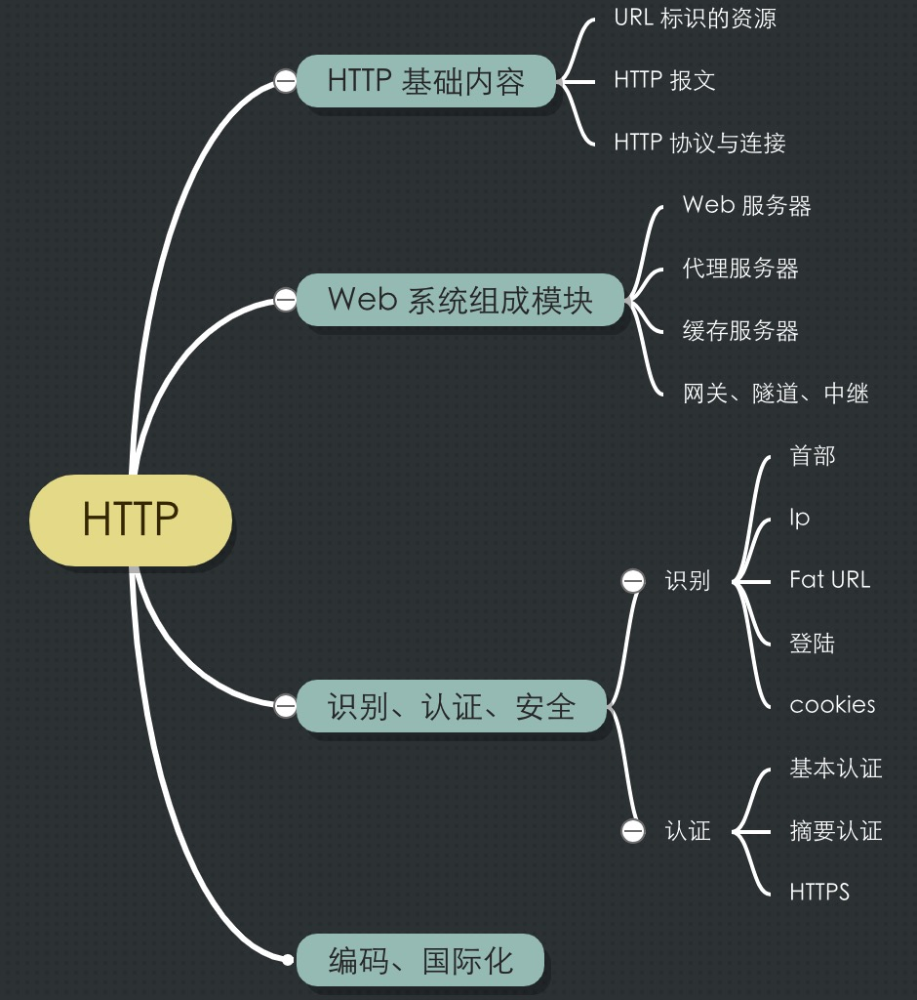
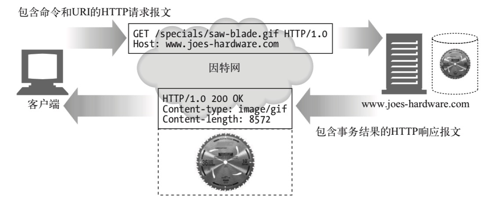
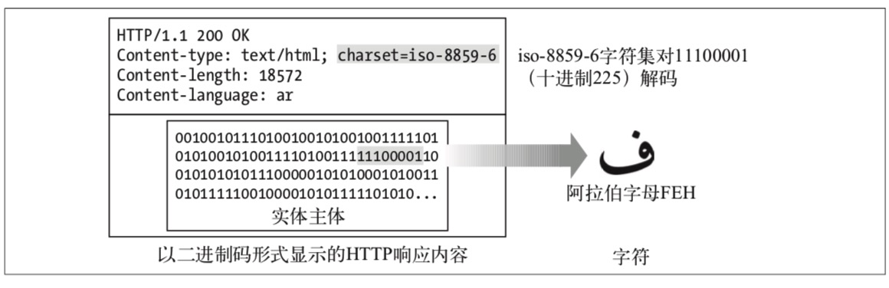

* 目录
{:toc}

Wikipedia 上 [HTTP](https://zh.wikipedia.org/wiki/%E8%B6%85%E6%96%87%E6%9C%AC%E4%BC%A0%E8%BE%93%E5%8D%8F%E8%AE%AE) 的定义为:
> 超文本传输协议（英语：HyperText Transfer Protocol，缩写：HTTP）是一种用于分布式、
协作式和超媒体信息系统的应用层协议。HTTP是万维网的数据通信的基础。

所谓「HyperText」是指不限于文本传输，还用于如图片、声音等介质，可见 
[超媒体](https://zh.wikipedia.org/wiki/%E8%B6%85%E5%AA%92%E9%AB%94)的定义。

HTTP 包含的内容主要是下面这几部分。

<p style="text-align:center">

</p>

# 1 HTTP 基础

<p style="text-align:center">

</p>

## 1.1 URL

URL 全名为统一资源定位符，是 URI(统一资源标识符)的子集，URI 还包含 URN。

作为资源定位表述，URL 并不限定于定位通过 HTTP 协议方式获取的资源，还包含如FTP/SMTP，甚至是 Jar 协议的资源表述定位。

### 1.1.1 语法

URL 语法如下：

`<scheme>://<user>:<password>@<host>:<port>/<path>;<params>?<query>#<frag>`

* scheme: 方案，如 HTTP/SMTP 等。
* user & password:用户名、密码。和 host 之间以通用的 @ 连接。
* host:port: 主机以及端口。
* path：资源路径。和主机或者端口之间以 `/` 分隔，这也是通用的 Linux 风格的路径表述方式。如 `https://younghz.github.io/springapplication-core-process-and-extentions`。
* param：参数，与路径之间使用 `;` 分隔，如果存在多个参数，也是使用 `;` 分隔。如`ftp://prep.ai.mit.edu/pub/gnu;type=d`。
* query: 查询，使用 `？` 与前面的部分分隔，如果存在多个，则使用 `&` 分隔。如在 google 中搜索 http 时，会使用 `https://www.google.com/search?hl=zh-CN&authuser=0&ei=w9YDXOTXDbnK0PEPxIOuwAo&q=http&oq=http` 请求。
* frag: 资源的一部分，这个字段不会传给服务器，只是在客户端使用，如用来在浏览器直接显示某一章节。与前面部分使用 `#` 分隔。如`http://www.joes-hardware.com/tools.html#drills`。

### 1.1.1 URL 编码

URL 字符集为 ASCII(7位二进制码标识)的子集，这个子集通常称为「URL安全字符集」，安全字符集排除了 ASCII 字符集中的如 `%`、`#` 等 URL 语法保留字符。因为 URL 字符集为 ASCII 的子集，所以当 URL 中出现非安全字符集中的字符时，需要通过 __编码__ 来避开这种限制性，保证 URL 的可移植性。

URL 编码机制：非安全字符包含一个百分号(%)，后面跟着表示字符 ASCII 码的 十六进制数。如包含空格的 URL `http://www.a.com/ a.html` 转义后为`http://www.a.com/%20a.html` 。 

## 1.2 报文

HTTP 报文是由

* 起始行
* 首部
* 实体

构成的具有特定规范格式的内容体。

报文分为 请求报文 和 响应报文。
请求报文的语法是：

```text
<method> <request-URL> <version> 

<headers>

<entity-body>
```

响应报文的语法是：

```text
<version> <status> <reason-phrase> 

<headers>

<entity-body>
```

### a. 起始行

如上报文格式，起始行在请求报文和响应报文的格式不同，分别是 `<method> <request-URL> <version>` 和 `<version> <status> <reason-phrase>`，请求报文起始行描述 '使用 version 版本的 HTTP 协议通过 method 方法去 request-URL 获取资源'，响应报文描述 '服务器针对当次请求的响应状态 status，以及响应状态的描述短语。并同时说明此次响应的 HTTP version。'

__method__

作为文本（资源）传输协议，HTTP 使用 「方法」 来描述客户端希望服务端针对资源执行的操作。HTTP 默认支持7种资源操作方法，分别是：

1. GET。从服务器获取资源。
2. PUT。和 GET 相反，PUT 是向服务器写入资源。如客户端使用 PUT 方法向服务端发送 'new html' 实体内容，服务端创建新的资源 new.html，其内容为客户端发送实体，然后向客户端返回新创建资源的 URL http://www.test.com/new.html。
3. POST。POST 通常用来向服务端发送表单数据。
4. HEAD。HEAD 和 GET 类似，当服务器收到 HEAD 请求时，只返回响应头。HEAD 可以用来判断资源是否存在、修改过等可以通过 headers 判断的信息。
5. DELETE。用来删除资源。
6. TRACE。服务端收到 TRACE 请求后，会将收到的报文放到实体中返回给客户端。TRACE 请求一般用于发起环形诊断，用于判断客户端到服务端之间请求是否被修改以及修改的内容。

__version__

Version 标记使用 HTTP 协议的版本，其格式为 `HTTP/<major>.<minor>` 

__status__

状态码。状态码分为五大类，从100开始，600结束，每类预分配100个整数标识状态。

* 其中 200-299 用来标识 成功。
* 300-399 标识 重定向，如 301 表示「永久移除」，并在 Header 中增加 Location 属性表示资源的当前位置。
* 400-499 标识 客户端错误。如 401 - 未认证、403 - 禁止访问、404 - Not Found 等。
* 500-599 标识 服务端错误。如 500-Internal Server Error、504-Gateway Timeout 等。

__header__

首部有五种，为：

* 通用首部。既可以在请求报文中，也可以在响应报文中，如 Date。
* 请求首部。请求报文特有的，如 Accept: text/html。
* 响应首部。响应报文特有的，如 Server。
* 实体首部。用于表示实体信息的，如 Content-Length: 277。
* 自定义首部。

## 1.3 协议与连接

HTTP 传输是建立在 TCP/IP 之上的，HTTP 要传送一条报文时，会以流的形式将报文数据的内容通过一条打开的 TCP 连 接按序传输。TCP 收到数据流之后，会将数据流砍成被称作段的小数据块，并将段 封装在 IP 分组中，通过因特网进行传输。也就是 "HTTP over TCP over IP"。

我们平时所述的 Socket 套接字，即为使用 TCP 的 API，同样，HTTP 也基于 TCP Socket 进行连接的建立与管理。

# 2 Web 系统结构

## 2.1 Web 服务器

纯粹的 Web 服务器如 Apache HTTP Server 更偏向于资源的操作。对于后端系统，我们常说的 Web 服务器为 Tomcat，或者更轻量级的 Jetty，事实上，它们承担的是 Web 服务器 + Servlet 容器 两项功能，这类服务器除了资源的可靠获取之外，还提供了动态流程的支持（在 Servlet 中，你可以做你任何希望做的事情）。

Web 服务器核心任务是接受连接并处理请求，支持的并发连接数以及能否高效处理连接通常作为服务器性能的衡量指标。

服务器使用的 IO 模型是其是否可称为高效服务器的基础，Web 服务器通常基于 Linux 提供的五种IO模型实现。

* 阻塞IO。
* 非阻塞IO.
* IO复用。
* 信号驱动。
* 异步AIO。

针对于这部分，可以参考 [《Netty 权威指南》](https://book.douban.com/subject/26373138/)，顺便了解下 Netty库。

## 2.2 代理

代理同样是 HTTP 服务器，科学上网的 ShadowSockets 就是在境外服务器上搭建 ss 服务器，转发请求实现。

## 2.3 缓存

单独的缓存服务器在当前的架构中并不常见，而是在后端服务器中通过访问集中式缓存如 Redis 这种方式实现。

## 2.4 网关

常见的网关是协议网关，如将 HTTP 协议转化为 Thrift 协议，还有一种为资源协议，如将 HTTP 协议转换为 MySQL 协议，直接去数据库中请求。

# 4 实体、编码、国际化

## 4.1 实体

实体 entity 是报文中需要传输内容的表述，实体包含 entity-body 与 entity-header，entity-header 用于描述实体类型、大小、修改时间、过期等信息。以下是两个常用的 entity-header:

* Content-Length: entity-body 的大小用 entity-body 中的 Content-Length 属性表示，如果存在编码，那么就是编码后的长度。
* Content-Type: 标识实体主题的 MIME 类型，常用类型如 text/html、text/plain、image/gif ... ，Content-Type 中还包含可选参数 charset 标识内容字符集，如 `Content-Type: text/html; charset=iso-8859-4`。

其它还包含如 Content-Encoding/Content-Language/Last-Modified/Cache-Control...

## 4.2 编码

编码是指对实体内容的可逆转换，常见的处理方式包含压缩、加密等。下图标识服务器使用 gzip 压缩，客户端使用 gizp 解压获取编码。

<p style="text-align:center">

</p>

其中的 `Content-Encoding: gzip` 为编码形式，除了 gzip 外，其它常见的编码如 zlib 格式的 deflate、Unix 文件压缩格式的 compress 等。

## 4.2 国际化

### a) 传输内容国际化

HTTP 的实体是 __二进制信息__ 的载体，所以可能承载任何形式媒体类型和任何语言。

几个概念：

* 字母表，每种语言都是有有限个字母表中的字母来表示。
* 字母（字符），字母表中的单独字母/字符，如英语中的 `a`，中文中的 `我`。
* 字符集。即用一个编码值（字符代码code point）来表示一个字符在字母表中的位置。
* 字符编码。二进制表述和字符集之间的映射过程。

而通常所述的编码包含上述 字符编码 和 字符集 两部分。

也就是，经过字符集编码的字符是 HTTP 最终传输的二进制数据。Content-Type 中的 charset 用来标识编码方式，如 `Content-Type: text/html; charset=iso-8859-6` 代表使用了 iso 编码方式。 而客户端使用 `Accept-Language` 和 `Accept-Charset` 头部表示客户端能处理的语言与编码。

如下两图说明了 HTTP 实体中的字符表示与字符编码流程。

<p style="text-align:center">

</p>

<p style="text-align:center">

</p>

关于字符编码，可以看看[这篇文章](http://cenalulu.github.io/linux/character-encoding/)，其中作者的经历也比较有意思。

### b) URI 国际化

如上 URI 部分所述，URI 是由 ASCII 的安全子集组成，ASCII 中的非安全字符采用 `%` + 字符级中编码值的十六进制表述，如 `%HEX` 。
至今 URI 对国际化没有很好的支持，仍推荐 ASCII 安全子集表述形式。


# 参考

* 《HTTP 权威指南》
