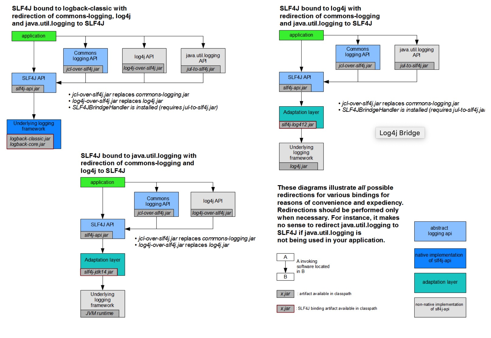
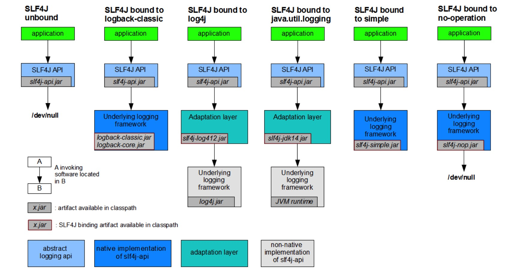

* 目录
{:toc}

日志是每个系统必不可少的一部分，其在系统中的重要程度不亚于系统代码。从日志作用来讲，日志可以用作问题排查，用作审计等；从日志存储来讲，最初日志基本都存储在本地，之后随着分布式系统发展，为了解决日志查询、分析等需求，日志被统一收集到集中式存储系统中；从日志格式讲，大部分日志都是无格式文本，但也有为了归档而存在的 k-v 形式 ...

在 Java 服务中，最常用的日志解决方案是 Log4j2, Log4j 中的组件解决了日志中可能遇到的所有问题，而问题解决的思路与实现方式也可以作为日志系统和其它系统中的问题实现参考。

# 1. Log4j

## 1.1 Jars

说起日志，只要开发过大型应用，总会或早或晚遇到一个问题，Log 包冲突。大量的 Log 实现（Log4j/Log4j2/Commons Logging/Logback...）、各种 Log 之间的桥接包、Facade 包（SLF4J）总会让你搞混，也正是因为过多的日志实现，催生了日志 Facade SLF4J 的出现与流行，使用 SLF4J，只需要通过只更换 Adaptor 包和 Log 实现包两步在不需要修改代码的情况下方便的替换底层日志实现。

总的来说，日志包一共分为四类：
1. Facade 包，SLF4J
2. Bridge 包，这类包的作用是将日志实现包 bridge 到接口包上，基本以 over 命名方式，如log4j-over-slf4j/ jcl-over-slf4j...  见：https://www.slf4j.org/legacy.html
3. Adaptor 包，这类包的作用是将接口包 adaptor 到实现包上，如 slf4j-log4j12、slf4j-jdk14 ...，见 https://www.slf4j.org/manual.html
4. 实现包，这类包是日志的真正实现，如 log4j/jcl/logback

其中 2 和 3 的图示如下。

<p style="text-align:center">

</p>

<p style="text-align:center">

</p>

注意：slf4j-log4j12 是 slf4j 到 log4j 1 的 adaptor 包，而到 log4j 2 的 adaptor 包是 log4j-slf4j-impl。

## 1.2 配置

关于 Log4j 的配置，可见：[https://logging.apache.org/log4j/2.x/manual/configuration.html](https://logging.apache.org/log4j/2.x/manual/configuration.html)。

最常见的配置模板如下：

```xml
<?xml version="1.0" encoding="UTF-8"?>;
<Configuration>
  <Properties>
    <Property name="name1">value</property>
    <Property name="name2" value="value2"/>
  </Properties>
  <filter  ... />
  <Appenders>
    <appender ... >
      <filter  ... />
    </appender>
    ...
  </Appenders>
  <Loggers>
    <Logger name="name1">
      <filter  ... />
    </Logger>
    ...
    <Root level="level">
      <AppenderRef ref="name"/>
    </Root>
  </Loggers>
</Configuration>
```

除了 XML, 还可以使用 JSON/YAML 形式配置 Log4j。

### a) 自动配置

Log4j 会按照 `log4j.configurationFile`(System Property) -> log4j2-test.(yml/json/xml) -> log4j2.(yml/json/xml) 的顺序在启动时查找配置，如果无可用配置，那么使用默认配置。默认配置效果如下：

```xml
<?xml version="1.0" encoding="UTF-8"?>
<Configuration status="WARN">
  <Appenders>
    <Console name="Console" target="SYSTEM_OUT">
      <PatternLayout pattern="%d{HH:mm:ss.SSS} [%t] %-5level %logger{36} - %msg%n"/>
    </Console>
  </Appenders>
  <Loggers>
    <Root level="error">
      <AppenderRef ref="Console"/>
    </Root>
  </Loggers>
</Configuration>
```

也就是 Console Appender 绑定到 level 为 error 的 Root Logger 上。

### b) Logger

Logger 使用 `logger` 元素配置，其中 name 为必填，而 Additivity 选填（默认 true），除此之外，还有标识日志级别的 level 项（选填，默认为 ERROR）。可以通过 AppenderRef 配置将多个 Appender 绑定到一个 Logger 上，这样，在制定日志处理时会逐个调用配置的 Appender。

每个 Logger 都存在一个 Root Logger（也可称为 Parent Logger），如果没有显式配置，那么会自动配置一个如 `a) 自动配置` 中所描述 Root Logger。和普通 Logger 不同的是，Root Logger 首先没有 name 属性，其次没有 additivity 属性，因为它没有父 Logger。

AsyncLogger 是 Log4j 的主要特性之一，其使用 Disruptor 实现高性能，低延时。具体详细可见[https://logging.apache.org/log4j/2.x/manual/async.html](https://logging.apache.org/log4j/2.x/manual/async.html)。
需要注意的是：

1. RingBufferSize，默认大小为 256 * 1024。可能产生的内存问题。
2. 异步可能丢失的日志信息。

### c) Additivity

如上 `b) Logger` 所述，每个 Logger 都会有个 Parent Logger，Additivity 元素是用来控制日志是否会从子 Logger 传递到父 Logger。Additivity 默认值为 true，在 Log4j 文档中，描述默认值为 true 是为了方便的支持如下形式的配置：

```xml
<Logger name="com.foo.Bar" level="TRACE"/>
<Root level="ERROR">
  <AppenderRef ref="STDOUT">
</Root>
```

也就是，如果没有配置 Logger 的 Appender，那么默认走到 Parent Logger，并使用 Parent Logger 的 Appender 输出。但是，由于在大部分情况下这种特性并非是希望的表现（可能造成日志重复输出，导致空间浪费，IO浪费...），所以，建议显式配置此属性为 false。

### d) Appender

Appender 负责日志事件 LogEvent 的最终`投递`。将其功能定义为 `投递` 而不是 `输出` 是因为 Appender 可以支持任何投递点，如默认存在的：

* 定位于本地磁盘输出的 RollingFileAppender
* 可以将日志通过 HTTP 传递的 HTTPAppender
* 可以支持投递到 KAFKA 的 KafkaAppender
* 其它的还有 FlumeAppender、JDBCAppender ...

除以上这些外，还有一个用来包装Appender 为异步 Appender 的 [AsyncAppender](https://logging.apache.org/log4j/2.x/manual/appenders.html#AsyncAppender)。Log4j 高性能的两种实现方式之一。

其配置形式如下：

```xml
<?xml version="1.0" encoding="UTF-8"?>
<Configuration status="warn" name="MyApp" packages="">
  <Appenders>
    <File name="MyFile" fileName="logs/app.log">
      <PatternLayout>
        <Pattern>%d %p %c{1.} [%t] %m%n</Pattern>
      </PatternLayout>
    </File>
    <Async name="Async">
      <AppenderRef ref="MyFile"/>
    </Async>
  </Appenders>
  <Loggers>
    <Root level="error">
      <AppenderRef ref="Async"/>
    </Root>
  </Loggers>
</Configuration>
```

AsyncAppender 使用 ArrayBlockingQueue 分析日志生产者和消费者，需要注意的是：

1. ArrayBlockingQueue 并非是无锁的，所以在多线程情况下，锁的争抢会造成性能降低。此时 Log4j 的建议方案是使用上方所说的 lock-free 的 AsyncLogger。
2. 所有基于 BlcokingQueue 实现的功能都会面临一个问题，当 Queue 满时的策略，Log4j 也不例外。Log4j 中通过 `blocking` 元素配置，建议将其配置为 false 以避免对业务的影响，当然这是在日志可被丢弃的前提下（Log4j 也支持配置 errorRef，在队列满情况下将 LogEvent 定向到 errorRef 指定的 Appender 中）。

### e) Layouts

Appender 使用 Layout 格式化 LogEvent。

最常用的为 PatternLayout，其使用 %c 控制 logger name 输出，使用 %d 控制日期格式输出。具体所有的配置可见 [https://logging.apache.org/log4j/2.x/manual/layouts.html#PatternLayout](https://logging.apache.org/log4j/2.x/manual/layouts.html#PatternLayout)。

### f) Filters

Appender 使用 Filter 控制 LogEvent 是否输出。常见的 Filter 包含：

1. ThresholdFilter。如 `<ThresholdFilter level="TRACE" onMatch="ACCEPT" onMismatch="DENY"/>` 标识只有 level 大于等于 Trace 的才允许输出。还可以组合多个 ThresholdFilter 精确的控制只有某个 level 的 LogEvent 才输出。
2. TimeFilter。只有 TimeFilter 中定义的时间区间日志才被输出。
3. BurstFilter。定义日志最大输出速率，当高于定义速率时静默抛弃。如 `<BurstFilter level="INFO" rate="16" maxBurst="100"/>` 表示当 LogEvent 每秒速率高于 16 并且当前队列中累积的 LogEvent 高于 100 时，所有日志级别 __高于或等于__ INFO 的日志将被丢弃。
4. DynamicThresholdFilter。DynamicThresholdFilter 可以基于特定属性值控制日志的动态输出。

针对上面的DynamicThresholdFilter, 以下是一个例子。 

```xml
  <DynamicThresholdFilter key="loginId" defaultThreshold="ERROR"
                          onMatch="ACCEPT" onMismatch="NEUTRAL">
    <KeyValuePair key="User1" value="DEBUG"/>
  </DynamicThresholdFilter>
```

上面的配置作用是：如果在 `org.apache.logging.log4j.ThreadContext` 中存在 loginId 这个 key，并且其值为 User1，那么修改默认的日志级别 ERROR 为 DEBUG。也就是当 User1 请求时，输出所有日志。你可以在 Servlet Filter 或者 Spring MVC Interceptor 或者任何 RPC 入口处使用 ThreadContext.put("loginId", "User1") 方式对 loginId 赋值。

## 1.3 扩展

Log4j 支持自定义扩展，具体可见：[https://logging.apache.org/log4j/2.x/manual/extending.html](https://logging.apache.org/log4j/2.x/manual/extending.html)。

# 2. 实现参考 & 技术点

## 2.1 Garbage-free Steady State Logging

[https://logging.apache.org/log4j/2.x/manual/garbagefree.html](https://logging.apache.org/log4j/2.x/manual/garbagefree.html) Log4j 在 2.6 之后，默认以 "garbage free" 模式运行，这种模式基于 「尽可能不分配临时对象，重用对象与缓冲区」实现。

## 2.2 AsyncAppender

AsyncAppender 基于 ArrayBlockingQueue 实现生产者消费者个分离，内部使用 `AsyncThread` 消费，其实现可作为此种情景的参考实现。

# 3. 实践

一个 log4j 的配置参考。

```xml
<?xml version="1.0" encoding="UTF-8"?>
<Configuration status="info" name="Sample" packages="">
    <Properties>
        <Property name="baseDir">/opt/logs/sample</Property>
    </Properties>
    <Appenders>
        <RollingFile name="sampleRollingFile" fileName="${baseDir}/rollingFileSample.log"
                     filePattern="${baseDir}/rollingFileSample-%d{yyyy-MM-dd}-%i.log.gz">
            <PatternLayout pattern="%d{yyyy-MM-dd HH:mm:ss.SSS} - - [%level] %t %c{1}  %msg%n" charset="UTF-8"/>
            <Policies>
                <TimeBasedTriggeringPolicy interval="1"/>
                <SizeBasedTriggeringPolicy size="512MB"/>
            </Policies>
            <!--
            max 表示符合 RollingFile 的 filePattern  %i 的保留策略，举个例子：
            * 如果配置为 `${baseDir}/rollingFileSample-%d{yyyy-MM-dd-mm}-%i.log.gz`  且使用上方 Policies，那么每分钟或者文件
              大小大于 512MB 都会触发 Rollover，此时文件 rollover 后的文件名如 `rollingFileSample-2019-01-03-59-1.log.gz`
              只有最后的 %i 大于 max 参数值时才会将之前的文件删除，并且重命名保留的文件。
              如果每分钟的日志都没有触发 SizeBasedTriggeringPolicy，那么会使用 TimeBasedTriggeringPolicy 策略，此时每分钟
              都会有一个文件，且不会触发删除策略（如果只是用 DefaultRolloverStrategy 不配置 DeleteAction 的话，此时会不断的累积
              文件，且不会自动删除。
              结论：如果希望更灵活的删除策略，如 rollingFileSample 最多不超过 30 个，那么需要使用 DeleteAction。
             -->
            <DefaultRolloverStrategy max="3" compressionLevel="0">
                <Delete basePath="${baseDir}" maxDepth="1">
                    <IfFileName glob="rollingFileSample-*.log.gz">
                        <!--可以使用 IfAny 组合条件，声明只有一个满足时就执行 DeleteAction，注意，只有当外部条件符合时才会进来-->
                        <IfAny>
                            <!--<IfLastModified age="60d"/>-->
                            <!--满足上方 FileName 为 rollingFileSample-*.log.gz 的文件多于 exceeds 个就会删除 -->
                            <IfAccumulatedFileCount exceeds="30"/>
                        </IfAny>
                    </IfFileName>

                </Delete>
            </DefaultRolloverStrategy>
        </RollingFile>

        <!--配置异步 Appender-->
        <!--正常情况下，异步 Appender 足够满足性能要求-->
        <Async name="asyncSampleAppender" blocking="false">
            <AppenderRef ref="sampleRollingFile"/>
        </Async>

        <Console name="Console" target="SYSTEM_OUT" follow="true">
            <PatternLayout pattern="%d{yyyy-MM-dd HH:mm:ss.SSS} - - [%level] %t %c{1}  %msg%n"
                           charset="UTF-8"/>
        </Console>
    </Appenders>
    <Loggers>
        <Logger name="asyncLogger" level="info" additivity="true">
            <AppenderRef ref="asyncSampleAppender"/>
        </Logger>
        <Root level="info">
            <AppenderRef ref="Console"/>
        </Root>
    </Loggers>
</Configuration>
```
