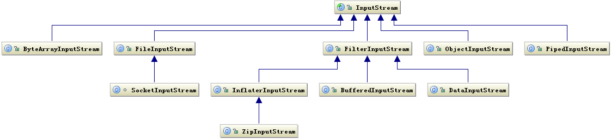

<p style="text-align:center">

</p>

* 目录
{:toc}

# 1 IO Stream

Java 类库中，关于 IO 的代码在 `java.io` package 下，整个包的围绕着:

* 基于字节操作的 I/O 接口：InputStream 和 OutputStream
* 基于字符操作的 I/O 接口：Writer 和 Reader
* 基于磁盘操作的 I/O 接口：File

三个核心接口展开。

需要注意的是：__网络传输和磁盘存储都是基于`字节`的，而语言是基于字符的，二者之间的转换即为编解码。__

## 1.1 InputStream/OutputStream

其中输入指从数据源（磁盘、网络）读取到内存中，输出即为内存数据输出到磁盘或网络等目标地。

### I） InputSteam 体系

InputStream 核心方法有：

* int read()。需要子类实现的读取方法，其中返回值为 0-255 正数（一个 byte 大小）或者 -1（结尾，无更多数据）。
* read(byte b[], int off, int len)。InputStream 的模板方法，其中三个参数分别代表：
    ```java
     b     the buffer into which the data is read.
     off   the start offset in array <code>b</code>
           at which the data is written.
     len   the maximum number of bytes to read.
    ```
* long skip(long n)。跳过 n 个字节。逻辑是将流中 n 个字节读取到临时 byte 数组中。

InputStream 类体系

<p style="text-align:center">

</p>

其中：

* FileInputStream 用于从文件读取字节。
* FilterInputStream 通常是另一个 stream 的包装器，意在提供为被包装的流提供额外特性。如 BufferedInputStream 通过缓存区避免每次 read/write 都直接操作 IO，达到更好的性能；ZipInputStream 用于压缩文件的读取。
* ObjectInputSteam。ObjectInputStream 依赖 java 序列化（seriliable），其提供了更多的用于直接读取对象的方法，如 
    ```java
       FileInputStream fis = new FileInputStream("t.tmp");
       ObjectInputStream ois = new ObjectInputStream(fis);
 
       int i = ois.readInt();
       String today = (String) ois.readObject();
       Date date = (Date) ois.readObject();
 
       ois.close();
    ```
* PipedInputStream。PipedInputStream 需要从一个 PipedOutputSteam 中读取数据，其常用情景是线程间通信，其中线程 A 向 PipedOutputSteam 中写数据，线程 B 从 PipedInputStream 中读取数据。(todo sample)


### II） OutputStream 体系

<p style="text-align:center">

</p>

## 1.2 Reader/Writer

基于字符读写类是围绕着 Reader 和 Writer 这两个核心接口展开的，磁盘存储和网络传输都是基于字节，由原生字节转换为字符需要进行解码。同样，由字符转换成字节需要做编码。

编解码的核心类是 `StreamEncoder` 和 `StreamDecoder`，二者使用 `Charset` 对 `OutputStream` 和 `InputStream` 做编解码。其中 `Charset` 即为 Java 中字符集的抽象，其实现类包含熟知的 ASCII/UTF-8 等。

### I) Reader 体系

<p style="text-align:center">

</p>

Reader 核心接口和 InputStream 基本一致，包含 read/close/skip 等，需要注意的是，如 `int read()` 接口，返回值范围 0-65535，即 4 个字节长度，同样，当流结束时，返回 -1。

### II) Writer 体系

<p style="text-align:center">

</p>

## 1.3 File

在系统设计中，文件通常用来：

* 记录日志。日志最常见的形式就是本地文件形式。
* 数据存储。类似 kafka，elasticsearch 通过将数据存储在单机磁盘上并依赖特定分布式协议实现分布式可扩展系统。
* 降级。同样存储系统所需资源，资源正常情况通过外部接口获得，每次获得最新数据后将数据快照保存到本次磁盘一份，当外部系统不可以时直接使用本地文件存储数据。
* 通信。两个进程基于文件通信。

`java.io.File` 是 Java 对文件的抽象类，可用来创建、删除文件，或者判读文件是否真实存在等操作。真正的文件读写依赖的是 `FileDescriptor` 类，FileDescritor 才是真正操作系统中文件指针（文件描述符）。一个系统能够打开的文件描述符是有限制的，所以当描述符不在使用时，需要调用 close 关闭。

# 2. 总结

Java 中，将 IO 数据抽象为 Stream - 流，流可以是字节流，也可以是字符流。

因为流操作通常持有系统资源，如 FileInputSteam 是持有文件描述符的，而操作系统可分配的文件描述符是有限的，所以，当流对象使用完毕时，需要关闭流。在流的各个扩展中，都有关闭方法 close 的默认实现。

在 Java7 中，为了解决代码中同时存在多个流的关闭导致的代码无序切庞大问题（通常是在 finnaly 中关闭流），引入了类似 python with 语法的 `try-with-resource` 语法糖，只需在 try 中包含资源变量，编译器会在代码构建时自动生成 try finally 逻辑，实现流的关闭。而这依赖于流实现了 AutoClosable 接口，当然如果希望在自定义类也能使用 `try-with-resource`，也可以扩展 AutoClosable 达到这个目的。

在字节流操作和字符流操作类中，都提供了 Buffered** 类，用来提供更高效的读写操作（和 CPU 速度相比，IO 操作是十分缓慢的）。在代码编写中，buffer 思想通常用来解决生产者和消费者速度不匹配可能产生的阻塞问题以及资源有限可能导致的资源争抢问题。

关于 IO 操作的常用类库有 commons-io, guava-io等，对于如计算 [校验和](https://zh.wikipedia.org/wiki/%E6%A0%A1%E9%AA%8C%E5%92%8C)、copy 操作，read 操作等都有封装。

__参考__:

* [深入分析 Java I/O 的工作机制
](https://www.ibm.com/developerworks/cn/java/j-lo-javaio/index.html)
* [Java IO](http://tutorials.jenkov.com/java-io/overview.html) - [中文翻译](http://ifeve.com/java-io-3/)