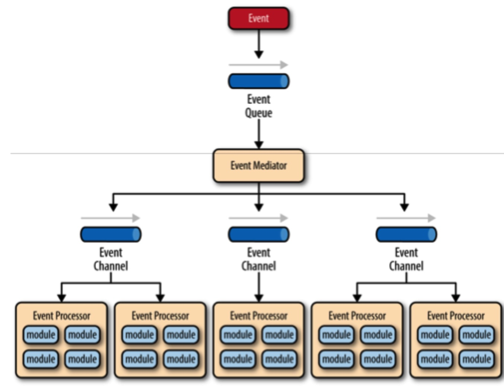
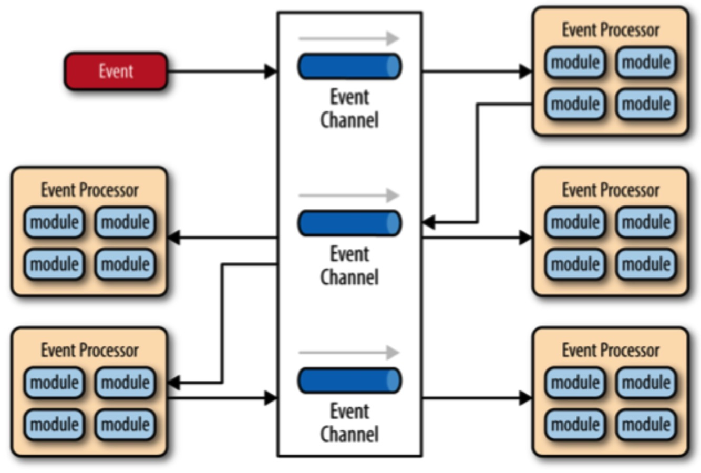
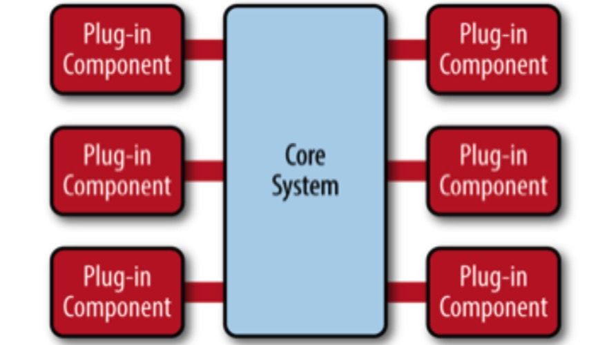
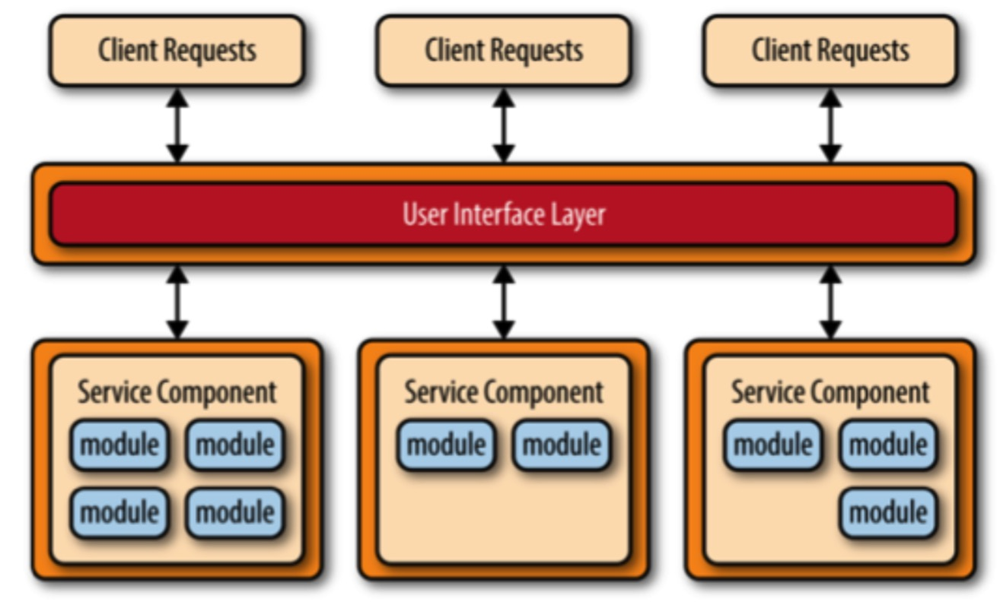
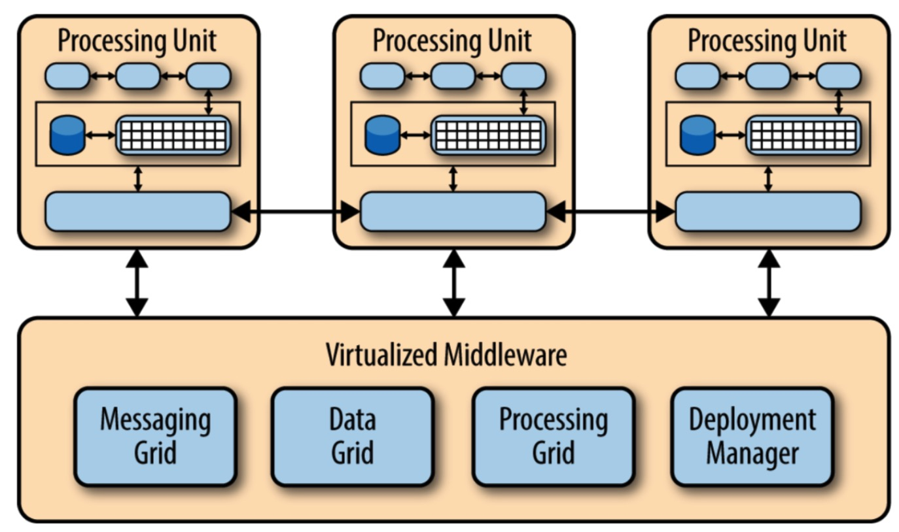
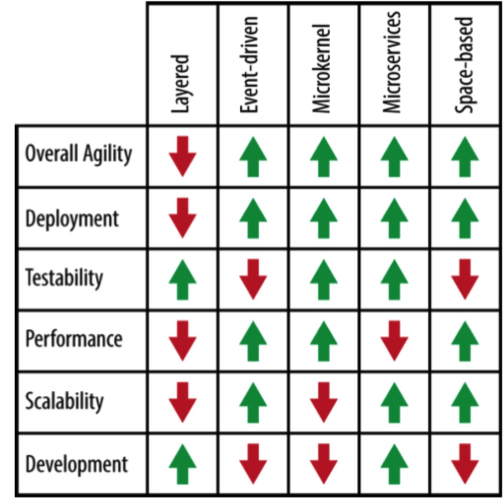

* 目录
{:toc}

在软件开发领域，「模式」是固定情景下的最佳实践方式的总结，像 Facade/Adaptor/Proxy 等软件设计模式一样，同样存在软件架构模式，[Software Architecture Patterns](https://book.douban.com/subject/26797547/) 一书中总结了常用的软件架构模式，并在性能、伸缩性、可测试性等几方面对比了不同设计模式的优点缺点。

什么是架构呢？架构是针对 __系统特点__ 选择最优 __架构模式__ 的过程。所以架构的流程是：

1. 分析系统特点，如系统关注性能还是关注扩展性？
2. 根据模式特性选择适合的一种或多种模式组合。

所以也可以将架构描述为 __系统特性 <-> 架构特性__ 的组合与双向选择的过程。

# 1 架构

常用架构模式：

1. 分层架构
2. 事件驱动架构
3. 微内核架构
4. 微服务架构
5. 基于空间的架构

## 1.1 分层架构

### I）架构

### II) 关键概念

__层隔离__  
架构中某一层的变化不会影响到其它层。

__开放层/封闭层__  
架构中只有相邻的上层才能返回下层，这种规则成为层封闭。而开发层的概念是指如果末一层是开放的，那么此层的上层可以不经过此层直接访问此层的下层。随意的开放层会导致层与层之间的耦合、难以维护。

__污水池反模式__  
在这种模式中，请求只是简单的穿过架构中的一层，对于这个请求，此层只是简单的传递。反模式类请求占总请求的比例可作为是否将层开放的判断指标。利用8-2原则，如果80%的请求只是简单的层穿越，在某一层中无任何逻辑，可考虑将此层开放。

III）分析
> 
> 整体灵活性  
> 评级:低 分析:总体灵活性是响应环境变化的能⼒力。尽管分层模式中的变化可以隔绝起来，想在这种架构中做⼀一些也改 变也是并且费时费⼒力的。分层模式的笨重以及经常出现的组件之间的紧耦合是导致灵活性降低的原因。  
>
> 易于部署  
> 评级:低 分析:这取决于你怎么发布这种模式，发布程序可能⽐比较⿇麻烦，尤其是很⼤大的项目。⼀个组件的⼩小⼩小改动可能 会影响到整个程序的发布(或者程序的⼤大部分)。发布必须是按照计划，在⾮工作时间或者周末进⾏行发布。因此。分层模式导致应⽤用发布⼀点也不流畅，在发布上降低了灵活性。
>
> 可测试性  
> 评级:⾼ 分析:因为组件都处于各⾃自的层次中，可以模拟其他的层，或者说直接去掉层，所以分层模式很容易测试。开 发者可以单独模拟⼀一个展⽰示组件，对业务组件进⾏行隔绝测试。还可以模拟业务层来测试某个展⽰示功能。
> 
> 性能  
> 评级:低 分析:尽管某些分层架构的性能表现的确不错，但是这个模式的特点导致它⽆无法带来⾼高性能。因为⼀次业务请 求要穿越所有的架构层，做了很多不必要的⼯工作。
>
> 伸缩性  
> 评级:低 分析:由于这种模式以紧密耦合的趋势在发展，规模也⽐比较⼤大，⽤用分层架构构建的程序都⽐比较难以扩展。你可以把各个层分成单独的物理模块或者干脆把整个程序分成多个节点来扩展分层架构，但是总体的关系过于紧密，这样很难扩展。
> 
> 易开发性  
> 评级:容易 分析:在开发难度上⾯面，分层架构得到了⽐比较⾼高的分数。因为这种架构对⼤大家来说很熟悉，不难实现。⼤大部分 公司在开发项目的都是通过层来区分技术的，这种模式对于⼤大多数的商业项目开发来说都很合适。公司的组 织架构和他们软件架构之间的联系被戏称为"Conway's law"。你可以Google⼀一下查查这个有趣的联系。

## 1.2 事件驱动架构

### I）架构

事件驱动架构分为：

* Mediator 拓扑架构。存在一个核心 Mediator 节点负责将 __初试事件__ 分配成多个 __待处理事件__，并协调多个待处理时间的协调执行。
* Broker 拓扑架构。不像 Mediator 架构存在中心节点，其中事件执行顺序依赖时间处理节点间的时间监听关系。

__Mediator 拓扑架构__

此架构由四个组件构成：

* 事件队列。初始事件投递通道。事件队列并不要求一定是消息队列，也可是 web 服务端等任何形式。
* 事件中介。事件中介接收到初试事件，并将初始事件分配为待处理时间，并协调待处理事件的执行顺序与待处理事件的分发。
* 事件通道。
* 事件处理器。多个事件处理器之间无关，独立运作，高度解耦。__这也是 Mddiator 拓扑架构__ 和 Broker 拓扑架构的主要区别点之一。

事件中介最简单、常⻅见的实现就是使⽤用开源框架，例如:Spring Integration，Apache Camel，或 Mule ESB。

__Broker 拓扑架构__

上图并不能清晰的反应 Broker 拓扑结构，Broker 架构的处理器节点之间有上下游之间的关系，一个事件先又上游处理器节点处理，然后产生一个新的事件发送到消息队列中，又此消息队列的订阅者处理。但⼀旦某个事件处理器将事件传递给另⼀个事件处理器，那么这个事件处理器不会与该事件的后续处理产⽣生任何联系。

### II）分析

__问题__

> 实现事件驱动架构模式相对于实现其他架构模式会更困难⼀一些，因为它通过异步处理进⾏行事件分发。当你需 要在你的应⽤用中使⽤用这种架构模式，你必须处理各种由事件分发处理带来的问题，例如:远程操作功能的可 ⽤用性，缺少权限，以及在代理或中介中处理事件失败时，⽤用于处理这种情况的重连逻辑。如果你不能很好地 解决这些问题，那你的应⽤用⼀一定会出现各种 Bug，让开发团队痛苦不已。

__分析__

> 整体灵活性  
> 评价:⾼高  
> 分析:整体灵活性⽤用于评价架构能否在不断改变的使⽤用场景下快速响应，因为事件处理器组件使⽤用⺫⽬目的单一、⾼高度解耦、与其他事件处理器组件相互独⽴立，不相关联，那么发⽣生的改变对⼀一个或多个事件处理器来说普遍都是独⽴立的，使得对改变的反馈⾮非常迅速，不需要依赖其他事件处理器的响应作出处理。
> 
> 易于部署  
> 评价:⾼高  
分析:总的来看，事件驱动架构模式由于其⾼高度解耦的事件处理器组件的存在，对事件的部署相对来说⽐比较 容易，⽽而使⽤用代理拓扑结构⽐比使⽤用中介拓扑结构进⾏行事件调度会更容易⼀一些，主要是因为在 中介拓扑结构中 事件处理器与事件中介紧密地耦合在⼀一起:事件处理器中发⽣生改变后，事件中介也随之改变，如果我们需要 改变某个被处理的事件，那么我们需要同时调度事件处理器和事件中介。
> 
> 可测试性  
> 评价:低  
> 分析:虽然在事件驱动架构模式中进⾏行单元测试并不困难，但如果我们要进⾏行单元测试，我们就需要某种特定的测试客户端或者是测试⼯工具产⽣生事件，为单元测试提供初始值。此外，由于事件驱动架构模式是异步进⾏行事件分发的，其异步处理的特性也为单元测试带来了⼀一定的困难。
>
> Performance 性能  
> 评价:⾼高  
> 分析:对消息传递的架构可能会让设计出来的事件驱动架构的表现不如我们的期望，但通常来说，该模式都能通过其异步处理的特性展⽰示优秀的性能表现;换句话来说，⾼高度解耦，异步并⾏行操作⼤大减少了传递消息过程中带来的时间开销。
> 
> 伸缩性  
> 评价:⾼高  
> 分析:事件驱动架构中的⾼高度解耦、相互独⽴立的事件处理器组件的存在，使得可拓展性成为该架构与⽣生俱来的优点。架构的这些特定使得事件处理器能够进⾏行细粒度的拓展，使得每⼀一个事件处理器都能单独被拓展，⽽而不影响其他事件处理器。

> 易于开发  
> 评价:低  
> 分析:由于使⽤用事件驱动架构进⾏行开发需要考虑其异步处理机制、协议创建流程，并且开发者需要⽤用代码为事件处理器和操作失败的代理提供优秀的错误控制环境，⽆无疑使得⽤用事件驱动架构进⾏行开发会⽐比使⽤用其他架构进⾏行开发要困难⼀一些。

## 1.3 微内核架构(插件化架构)

### I）架构

### II) 关键概念

__适用情景__

> 微内核架构模式(也称为插件化应⽤用架构)对于基于产品的应⽤用程序来说是⼀一个很⾃自然的选择。基于产品的应 ⽤用是指⼀一个经过打包的、可以通过版本下载的⼀一个典型的第三⽅方产品。微内核 架构模式可以通过插件的形式添加额外的特性到核⼼心系统中，这提供了很好的扩展性，也使得新特性与核⼼心 系统隔离开来。

__系统构成__

微内核架构由两部分构成：

* 核心系统。核心系统可以有两种定义方式，一是是系统运行的最小模块；而是包含公共逻辑的模块。
* 插件模块。包含特定规则逻辑并且可以集成到核心系统中扩展核心系统能力。

需要注意的是，在这种系统架构中，插件模块不可以互相依赖。

### III）分析

> 整体灵活性  
> 评级:⾼高  
> 分析 : 整体灵活性是指能够快速适应不断变化的环境的能⼒力。通过插件模块的松耦合实现，可以将变化隔离 起来，并且快速满⾜足需求。通常，微内核架构的核⼼心系统很快趋于稳定，这样系统就变得很健壮，随着时间 的推移它也不会发⽣生多⼤大改变。
>
> 易于部署  
> 评级:⾼高  
> 分析 : 根据实现⽅方式，插件模块能够在运⾏行时被动态地添加到核⼼心系统中 ( ⽐比如，热部署 ),把停机时间减 到最⼩小。
> 
> 可测试性  
> 评级:⾼高  
> 分析 : 插件模块能够被独⽴立的测试，能够⾮非常简单地被核⼼心系统模拟出来进⾏行演⽰示，或者在对核⼼心系统很⼩小 影响甚⾄至没有影响的情况下对⼀一个特定的特性进⾏行原型展⽰示。
> 
> 性能  
> 评级:⾼高  
> 分析 : 使⽤用微内核架构不会⾃自然⽽而然地使你的应⽤用变得⾼高性能。通常，很多使⽤用微内核架构的应⽤用运⾏行得很 好，因为你能定制和简化应⽤用程序，使它只包含那些你需要的功能模块。JBoss应⽤用服务器就是这⽅方⾯面的优 秀⽰示例: 依赖于它的插件化架构，你可以只加载你需要的功能模块，移除那些消耗资源但没有使⽤用的功能特 性，⽐比如远程访问，消息传递，消耗内存、CPU的缓存，以及线程，从⽽而减⼩小应⽤用服务器的资源消耗。
>
> 伸缩性  
> 评级:低  
> 分析 : 因为微内核架构的实现是基于产品的，它通常都⽐比较⼩小。它们以独⽴立单元的形式实现，因此没有太⾼的伸缩性。此时，伸缩性就取决于你的插件模块，有时你可以在插件级别上提供可伸缩性，但是总的来说这个架构并不是以构建⾼高度伸缩性的应⽤用⽽而著称的。
> 
> 易于开发  
> 评级:低  
> 分析 : 微内核架构需要考虑设计和规约管理，使它不会很难实现。规约的版本控制，内部的插件注册，插件 粒度，丰富的插件连接的⽅方式等是涉及到这个架构模式实现复杂度的重要因素。

## 1.4 微服务架构

### I）架构

对于这种架构，最常见的是基于 NG 的 Rest 微服务架构。

### II）分析

> 整体灵活性  
> 评级:⾼  
> 分析:整体的灵活性是能够快速响应不断变化的环境。由于单独部署单元的概念,变化通常被隔离成单独的服 务组件,使得部署变得快⽽而简单。同时，使⽤用这种模式构建的应⽤用往往是松耦合的，也有助于促进改变。
>
> 易于部署  
> 评级:高  
> 分析:整体来讲，由于该模式的解耦特性和事件处理组件使得部署变得相对简单。broker拓扑往往⽐比 mediator拓扑更易于部署，主要是因为event-mediator组件与事件处理器是紧耦合的，事件处理器组件有⼀一个 变化可能导致event mediator跟着变化，有任何变化两者都需要部署。
> 
> 可测试性  
> 评级:高  
> 分析:由于业务功能被分离成独⽴立的应⽤用模块,可以在局部范围内进⾏行测试，这样测试⼯工作就更有针对性。对 ⼀一个特定的服务组件进⾏行回归测试⽐比对整个单体应⽤用程序进⾏行回归测试更简单、更可⾏行。⽽而且,由于这种模式 的服务组件是松散耦合的，从开发⾓角度来看，由⼀一个变化导致应⽤用其他部分也跟着变化的⼏几率很⼩小，并能减 ⼩小由于⼀一个微⼩小的变化⽽而不得不对整个应⽤用程序进⾏行测试的负担。
> 
> 性能  
> 评级:低  
> 分析:虽然你可以从实现该模式来创建应⽤用程序并可以很好的运⾏行，整体来说，由于微服务架构模式的分布式特性，并不适⽤用于⾼高性能的应⽤用程序。
> 
> 伸缩性  
> 评级:⾼  
> 分析:由于应⽤用程序被分为单独的部署单元,每个服务组件可以单独扩展，并允许对应⽤用程序进⾏行扩展调整。 例如，股票交易的管理员功能区域可能不需要扩展，因为使⽤用该功能的⽤用户很少，但是交易布局服务组件可 能需要扩展，因为⼤大多数交易应⽤用程序需要具备处理⾼高吞吐量的功能。
> 
> 易于开发
> 评级:⾼  
> 分析:由于功能被分隔成不同的服务组件，由于开发范围更⼩小且被隔离，开发变得更简单。程序员在⼀个服务组件做出⼀一个变化影响其他服务组件的⼏几率是很⼩小的，从⽽而减少开发⼈人员或开发团队之间的协调。

## 1.5 基于空间架构（云架构模型）

__背景__

> 大多数基于⺴⽹网站的商务应⽤用都遵循相同的请求流程:⼀一个请求从浏览器发到web服务器，然后到应⽤用服务 器，然后到数据库服务器。虽然这个模式在⽤用户数不⼤大的时候⼯工作良好，但随着⽤用户负载的增加,瓶颈会开始 出现，⾸首先出现在web服务器层，然后应⽤用服务器层，最后数据库服务器层。通常的解决办法就是向外扩 展，也就是增加服务器数量。这个⽅方法相对来说简单和廉价，并能够解决问题。然⽽而，对于⼤大多数⾼高访问量 的情况，它只不过是把web服务器的问题移到了应⽤用服务器。⽽而扩展应⽤用服务器会更复杂，⽽而且成本更⾼高， 并且⼜又只是把问题移动到了数据库服务器，那会更复杂，更贵。就算你能扩展数据库服务器，你最终会陷⼊入 ⼀一个⾦金字塔式的情形，在⾦金字塔最下⾯面是web服务器，它会出现最多的问题，但也最好伸缩。⾦金字塔顶部是 数据库服务器，问题不多，但最难伸缩。

__适用情景__

> 基于空间的架构模型是专⻔门为了解决伸缩性和并发问题⽽而设计的。它对于⽤用户数量不可预测且数量级经常变 化的情况同样适⽤用。在架构级别来解决这个伸缩性问题通常是⽐比增加服务器数量或者提⾼高缓存技术更好的解 决办法。

### I）架构

这个架构中有两个主要的模块:处理单元 和 虚拟化中间件

> 虚拟化中间件负责保护⾃自⾝身以及通信。它包含⽤用于数据同步和处理请求的模块，以及通信框架，数据框架，
处理框架和部署管理器。

> 从产品实现的⾓角度讲，这个架构中的很多组件都可以从第三⽅方获得，⽐比如GemFire, JavaSpaces, GigaSpaces，IBM Object Grid，nCache，和 Oracle Coherence。

III）分析

> 综合能⼒  
> 评分:⾼  
> 分析:综合能⼒力是对环境变化做出快速反应的能⼒力。因为处理单元(应⽤用的部署实例)可以快速的启动和关闭，整个应⽤用可以根据⽤用户量和负载做出反应。使⽤用这个架构通常在应对代码变化上，由于较⼩小的应⽤用规模和组件间相互依赖，也会反映良好。
> 
> 易于部署  
> 评分:⾼  
> 分析:虽然基于空间的架构通常没有解耦合并且功能分布，但他们是动态的，也是成熟的基于云的⼯工具，允许应⽤用轻松的部署到服务器。
> 
> 可测试性  
> 评分:低  
> 分析:测试⾼高⽤用户负载既昂贵⼜又耗时，所以在测试架构的可伸缩性⽅方⾯面很困难
>
> 性能  
> 评分:⾼  
> 分析:通过内存中数据存取和架构中的缓存机制可获得⾼高性能
> 
> 伸缩性  
> 评分:⾼  
> 分析:⾼高伸缩性是源于⼏几乎不依赖集中式的数据库，从⽽而去除了这个限制伸缩性的瓶颈。
> 
> 易于开发  
> 评分:低  
> 分析:主要是因为难以熟悉这个架构开发所需得⼯工具和第三⽅方产品，因此使⽤用该架构需要较⼤大的学习成本。⽽而且，开发过程中还需要特别注意不要影响到性能和可伸缩性。

所有架构对比如下

# 2 总结

一个大型系统中，通常是多种架构模式的组合，如整体架构是分层架构，架构中可扩展部分采用微内核架构。

模式是最佳实践，是沉淀下的技术产物，模式的使用意味着系统是完善设计的，非混乱的。但同时，没有任何一种模式可以解决复杂系统中的所有问题，使用模式并不拘与模式才能更好的解决问题，架构系统。

如书中所述：

> 应⽤用程序缺乏合理的架构一般会导致程序过度耦合、容易被破坏、难以应对变化，同时很难有一个 __清晰的版本或者方向性__ 。这样的结果是，如果你没有充分理解程序系统⾥里每个组件和模块，就很难定义这个程序的结 构特征。有关于程序的部署和维护的基本问题都难以回答，比如:程序架构是什么规模?应⽤用程序有什么性能特点?应⽤用程序有多容易应对变化?应⽤用程序的部署特点是什么?架构是如何反应的?  
> 架构模式帮助你定义应⽤用程序的基本特征和⾏行为。例如，一些架构模式会让程序⾃自⼰己⾃自然⽽而然地朝着具有良
好伸缩性的⽅方向发展，⽽而其他架构模式会让程序朝着⾼高度灵活的⽅方向发展。知道了这些特点，了解架构模式
的优点和缺点是⾮非常必要的，它帮助我们选择⼀一个适合⾃自⼰己特定的业务需求和⺫⽬目标的的程序。