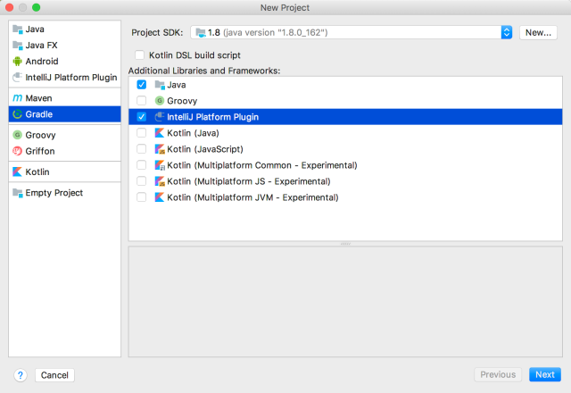

* 目录
{:toc}

# 1 前言

IntelliJ IDEA 无疑是 Java 开发中最好用的 IDE，除了自身的功能，丰富的插件简化了开发过程中的重复工作，如用来编写git ignore文件
的.gitignore插件；在IDE中支持 vim 模式的 IdeaVIM 插件。通常，大部分你需要使用的插件都可以从 
[https://plugins.jetbrains.com/idea](https://plugins.jetbrains.com/idea) 中找到，如果是定制性较强的功能，如公司内部工具，
可能需要自己手动编写插件做功能增强。国内最广泛传播的两个 IDEA 插件都来自阿里，分别是：

1. [Cloud Toolkit](https://cn.aliyun.com/product/cloudtoolkit)
2. [P3C](https://github.com/alibaba/p3c/wiki/IDEA%E6%8F%92%E4%BB%B6%E4%BD%BF%E7%94%A8%E6%96%87%E6%A1%A3)

一般来讲，如果是以下四方面的功能增强，可以开发插件来实现：
> The most common types of plugins include:
> * Custom language support
 * Framework integration
 * Tool integration
 * User interface add-ons

IDEA 插件编写并不复杂，只是资料较少，API 比较陌生。在官方 [DevGuide](https://www.jetbrains.org/intellij/sdk/docs/welcome.html)
中覆盖了几乎所有的插件开发声明周期内容。包含：

* [Plugins](https://www.jetbrains.org/intellij/sdk/docs/basics.html)。介绍了插件开发工具、基本工程结果、基本配置等。
* [Base Platform](https://www.jetbrains.org/intellij/sdk/docs/platform/fundamentals.html) 这部分介绍了如 Action/Virtual File/
Editor 等开发基础。
* [Project Module](https://www.jetbrains.org/intellij/sdk/docs/basics/project_structure.html)。介绍了 Project Wizard
编写等内容。
* [PSI](https://www.jetbrains.org/intellij/sdk/docs/basics/architectural_overview/psi.html)。PSI 是 IDEA 对所有项目
文件的抽象，这部分介绍了如何解析 class 文件为 PSI对象，如果在类中增加方法等。

其它还包含测试等功能介绍，具体可见 [DevGuide](https://www.jetbrains.org/intellij/sdk/docs/welcome.html)。

# 2 详细介绍

这里只详细介绍第一部分，在以下两方面说明：

* 如何搭建一个插件。
* 插件开发中一些需要了解的概念。

## 2.1 插件开发

插件有两种开发方式，其一是使用 Devkit，其二是使用 Gradle 插件。后者流程更简单，也是官方推荐的方式。下面 step by step 的说明详细步骤。

工具准备：

1. IntelliJ IDEA。这个你肯定安装了。
2. Gradle。

#### 1.安装开发插件

在当前 IDEA 中安装 Gradle 和 Plugin DevKit 两个插件，并 enable。

安装路径：Settings -> Plugins。

#### 2.新建 Plugin

路径： File -> New… -> Project。

<p style="text-align:center">

</p>

项目生成后，会生成如下 build.gradle。

```xml
plugins {
   id 'org.jetbrains.intellij' version '0.4.7'
}

group 'com.plugin.sample'
version '1.0-SNAPSHOT'

apply plugin: 'java'
apply plugin: 'idea'

sourceCompatibility = 1.8

repositories {
   mavenCentral()
}

dependencies {
   testCompile group: 'junit', name: 'junit', version: '4.12'
}

//在你的本地 gradle 中会下载  对应版本的开发包, 如 com.jetbrains.intellij.idea/ideaIC/2017.3.4
intellij {
   version '2017.3.4'
}
patchPluginXml {
   changeNotes """
     Add change notes here.<br>
     <em>most HTML tags may be used</em>"""
}
```

#### 3.run/debug

使用 gradle task run 或者 debug 应用。路径：View -> Tool Windows -> Gradle -> runIde .

关于 Gradle 插件的使用，可见 [https://github.com/JetBrains/gradle-intellij-plugin/blob/master/README.md)](https://github.com/JetBrains/gradle-intellij-plugin/blob/master/README.md))。

此时，一个不包含任何功能插件就运行起来了。

#### 4.修改 plugin.xml 文件

plugin.xml 为插件描述文件，包含插件的名字、版本、扩展属性等，需要修改为你的内容。其详细内容以及包含属性在下一个部分中说明。

#### 5.打包

执行 gradle 插件的 'buildPlugin' task，会在 build/distribution 目录下生成一个可安装的 zip 包。

#### 6.发布

执行 gradle 插件的 'publishPlugin'，这个会发布到 IDEA 的仓库，需要配置用户、密码。
详细可以参考：[https://www.jetbrains.org/intellij/sdk/docs/tutorials/build_system/deployment.html](https://www.jetbrains.org/intellij/sdk/docs/tutorials/build_system/deployment.html)

#### 注意

1. gradle 插件会下载在 build.gradle 中声明的 intellij {version '2017.3.4'} 包，会下载到
你的 gradle 仓库路径(.gradle/caches/modules-2) 下的com.jetbrains.intellij.idea/ideaIC/2017.3.4路径下，下载服务器是
IntelliJ 的服务器，这个域名在国内经常无法访问，可能需要加代理，否则下载速度很慢或无法下载。


## 2.2 插件其它概念

在 2.1 中建立一个无任何功能的插件，插件可以是 Action 的扩展，也可以是对平台扩展点的扩展。在开发插件过程中，应该熟悉
插件配置 plugin.xml、插件 components/service、icon 配置，依赖等。

#### 1.plugin.xml

插件配置主要包含下面这些元素，其解释可以看下方注释以及每部分详细解释。

```xml
<!-- `url` specifies the URL of the plugin homepage (can be opened from "Plugins" settings dialog) -->
<idea-plugin url="https://www.jetbrains.com/idea">

 <!-- Plugin name -->
 <name>VssIntegration</name>

 <!-- Unique identifier of the plugin.
      Cannot be changed between the plugin versions.
      If not specified, assumed to be equal to <name>. -->
 <id>com.jetbrains.vssintegration</id>

 <!-- Description of the plugin. -->
 <description>Vss integration plugin</description>

 <!-- Description of changes in the latest version of the plugin.
      Displayed in the "Plugins" settings dialog and in the
      plugin repository Web interface. -->
 <change-notes>Initial release of the plugin.</change-notes>

 <!-- Plugin version -->
 <version>1.0</version>

 <!-- The vendor of the plugin.
      The optional "url" attribute specifies the URL of the vendor homepage.
      The optional "email" attribute specifies the e-mail address of the vendor.-->
 <vendor url="https://www.jetbrains.com" email="support@jetbrains.com" />

 <!-- The unique identifiers of the plugins on which this plugin depends. -->
 <depends>com.MyFirstPlugin</depends>

 <!-- Optional dependency on another plugin.
      If the plugin with the "com.MySecondPlugin" ID is installed,
      the contents of mysecondplugin.xml (the format of this file
      conforms to the format of plugin.xml) will be loaded. -->
 <depends optional="true" config-file="mysecondplugin.xml">com.MySecondPlugin</depends>

 <!-- Allows a plugin to integrate its help system (in JavaHelp format)
      with the IDE help system. The "file" attribute specifies the name
      of the JAR file in the "help" subdirectory of the plugin directory.
      The "path" attribute specifies the name of the helpset file within
      the JAR file.-->
 <helpset file="myhelp.jar" path="/Help.hs" />

 <!-- Minimum and maximum build of IDE compatible with the plugin -->
 <idea-version since-build="183" until-build="183.*"/>

 <!-- Resource bundle (/messages/MyPluginBundle.properties) to be used
      with `key` attributes in extension points and implicit keys like
      `action.[pluginID].[ActionID].text` -->
 <resource-bundle>messages.MyPluginBundle</resource-bundle>

 <!-- Plugin's application components -->
 <application-components>
   <component>
     <!-- Component's interface class -->
     <interface-class>com.foo.Component1Interface</interface-class>

     <!-- Component's implementation class -->
     <implementation-class>com.foo.impl.Component1Impl</implementation-class>
   </component>
 </application-components>

 <!-- Plugin's project components -->
 <project-components>
   <component>
     <!-- Interface and implementation classes are the same -->
     <implementation-class>com.foo.Component2</implementation-class>

     <!-- If the "workspace" option is set "true", the component
          saves its state to the .iws file instead of the .ipr file.
          Note that the <option> element is used only if the component
          implements the JDOMExternalizable interface. Otherwise, the
          use of the <option> element takes no effect.  -->
     <option name="workspace" value="true" />

     <!-- If the "loadForDefaultProject" tag is present, the project component is instantiated also for the default project. -->
     <loadForDefaultProject/>
   </component>
 </project-components>

 <!-- Plugin's module components -->
 <module-components>
   <component>
     <implementation-class>com.foo.Component3</implementation-class>
   </component>
 </module-components>

 <!-- Actions -->
 <actions>
   <action id="VssIntegration.GarbageCollection" class="com.foo.impl.CollectGarbage" text="Collect _Garbage" description="Run garbage collector">
     <keyboard-shortcut first-keystroke="control alt G" second-keystroke="C" keymap="$default"/>
   </action>
 </actions>

 <!-- Extension points defined by the plugin.
      Extension points are registered by a plugin so that other
      plugins can provide this plugin with certain data. The
      "beanClass" attribute specifies the class the implementations
      of which can be used for the extension point. -->
 <extensionPoints>
   <extensionPoint name="testExtensionPoint" beanClass="com.foo.impl.MyExtensionBean"/>
 </extensionPoints>

 <!-- Extensions which the plugin adds to extension points
      defined by the IntelliJ Platform or by other plugins.
      The "defaultExtensionNs " attribute must be set to the
      ID of the plugin defining the extension point, or to 
      "com.intellij" if the extension point is defined by the
      IntelliJ Platform. The name of the tag within the <extensions>
      tag matches the name of the extension point, and the
      "implementation" class specifies the name of the class
      added to the extension point. -->
 <extensions xmlns="VssIntegration">
   <testExtensionPoint implementation="com.foo.impl.MyExtensionImpl"/>
 </extensions>
</idea-plugin>
```

#### 2.plugin 类加载器

每个插件都又单独的 class loader 加载，并且加载策略为插件优先，加载不到才去平台加载。

需要注意的是，插件不应该在 build.gradle 中声明任何 IntelliJ 的包，这些依赖会又插件引入，并且在打包是不打进插件发布包。
当包含 IntelliJ 的依赖时，会有类加载问题。

#### 4.plugin components

plugin components 包含三种类型：

> 
>* Application level components are created and initialized when your IDE starts up. They can be acquired from the Application instance by using the getComponent(Class) method.
>* Project level components are created for each Project instance in the IDE. (Please note that components may be created even for unopened projects.) They can be acquired from the Project instance by using the getComponent(Class) method.
>* Module level components are created for each Module inside every project loaded in the IDE. Module level components can be acquired from a Module instance with the getComponent(Class) method.

这里强调两个内容：

1. 这些类型的 component 会在相应的时机被「实例」。
2. 这些类型的 component 会根据其类型不同以及用户工程不同实例不同数量的实例。

如果你需要在不同时机、不同情境下自动实例相应的类，那么可以使用 component, 其配置方法可以参考上方的 plugin.xml。

详细内容可参考：[https://www.jetbrains.org/intellij/sdk/docs/basics/plugin_structure/plugin_components.html](https://www.jetbrains.org/intellij/sdk/docs/basics/plugin_structure/plugin_components.html)。


#### 5.plugin service

service 和上方的 plugin component 基本一致，只不过实例时机不同，plugin component 自动实例，而 plugin service 是你
按需调用 ServiceManager 接口实例。

IntelliJ 提供了一个描述 plugin component 和 plugin service 的使用情景非常好的例子，计算打开工程的数量，可以在
[https://github.com/JetBrains/intellij-sdk-docs/blob/master/code_samples/max_opened_projects/src/MyPackage/MaxProject.java](https://github.com/JetBrains/intellij-sdk-docs/blob/master/code_samples/max_opened_projects/src/MyPackage/MaxProject.java)
这里找到。

针对于 plugin service 在 plugin.xml 中配置也可见参考上面的例子。

#### 6.plugin icon

用于定制插件的 icon，详细的可见：[icon 定制](https://www.jetbrains.org/intellij/sdk/docs/basics/plugin_structure/plugin_icon_file.html)。

#### 7.plugin 扩展和扩展点

用来扩展 IntelliJ 的功能，或者定义扩展点供其它插件使用。

#### 8.plugin dependencies

在插件开发中可以复用其它插件的类，因为插件不是一个普通的 jar，所以你无法直接使用 build.gradle 引入。这种依赖关系可以在
plugin.xml 中通过下面方式引入：

首先，通过以下方式声明：

```xml
intellij {
   plugins 'org.jetbrains.kotlin:1.3.11-release-IJ2018.3-1'
}
```

其次，增加<depends>标签：

```xml
<depends>org.jetbrains.kotlin</depends>
```

此时，你可以使用其它插件中类。但是，如果你依赖的插件没有在使用这个插件的IDE中安装，那么插件无法使用，此时可以通过声明 optional 的
方式依赖，具体可见：[https://www.jetbrains.org/intellij/sdk/docs/basics/plugin_structure/plugin_dependencies.html](https://www.jetbrains.org/intellij/sdk/docs/basics/plugin_structure/plugin_dependencies.html)

#### 9.plugin actions

Plugin Actions 是最常见的插件扩展方式，用来在如菜单栏，右键弹窗中增加选择项，触发相应功能。新建 Action 可以通过 Plugin Devkit触发。
路径为 New | Plugin DevKit | Action 方式新建。

在 Action 编写过程中，如果使用表单或者 Dialog，可以使用方便的所见即所得方式，具体路径为 New -> Dialog。

一个简单的例子为：

```java
package sample;

import com.intellij.openapi.actionSystem.AnAction;
import com.intellij.openapi.actionSystem.AnActionEvent;
import com.intellij.openapi.project.Project;

import java.awt.*;

public class HelloAction extends AnAction {
 public HelloAction() {
   super("Hello");
 }

 @Override
 public void actionPerformed(AnActionEvent event) {
   Project project = event.getProject();

   Dialog dialog = new SampleDialog();
   dialog.setLocationRelativeTo(null);

   dialog.pack();
   dialog.setVisible(true);
 }
}
```

其中 Action 对应的 plugin.xml 配置，会在 New -> Plugin DevKit -> Action 新建时创建。

# 3 总结

简单而又切中要点的插件无疑比其它形式的工具更方便、更高效。

掌握上面的流程与要点基本就可以上手定制你自己的插件。

# 4 参考

* [官方 sample](https://github.com/JetBrains/intellij-sdk-docs/blob/master/code_samples)。其中
有丰富的各种情景的开发实例。可以作为首要参考。
* [官方文档](https://www.jetbrains.org/intellij/sdk/docs/welcome.html)。
* [https://plugins.jetbrains.com/idea](https://plugins.jetbrains.com/idea)。可以先搜搜功能相近的插件，参考。
* [开发使用的 gradle 插件](https://github.com/JetBrains/gradle-intellij-plugin/blob/master/README.md)。

