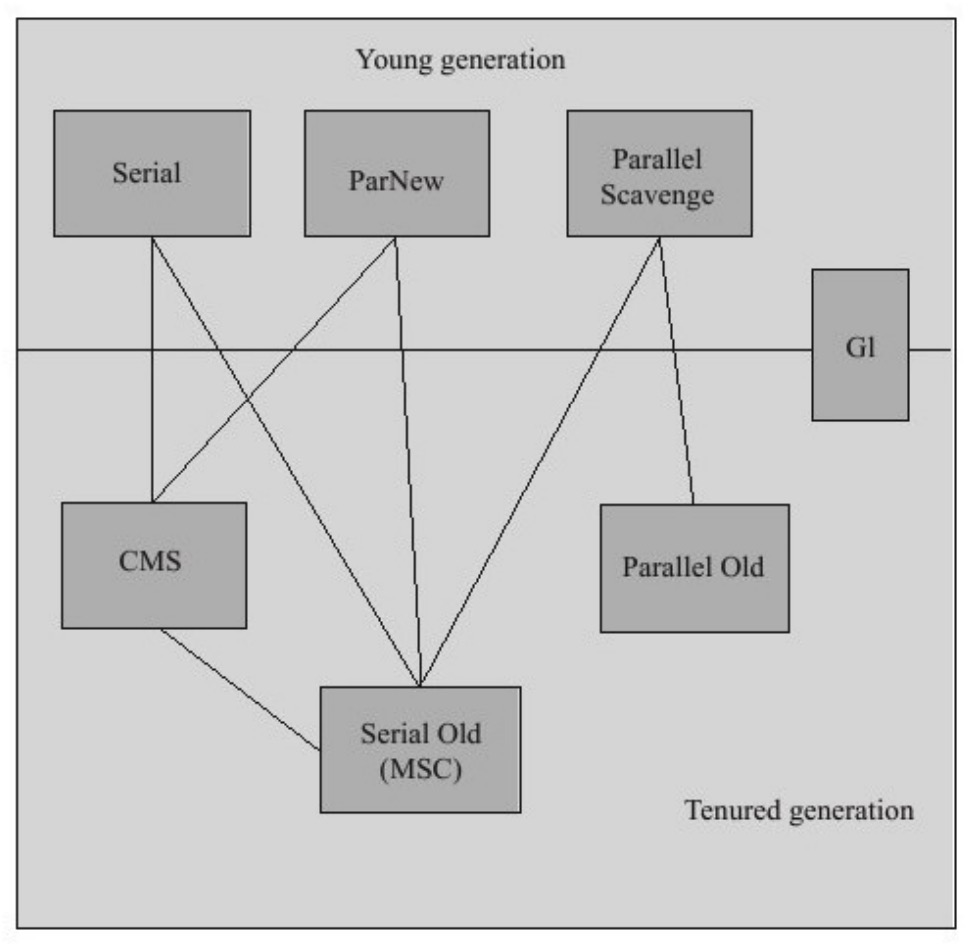
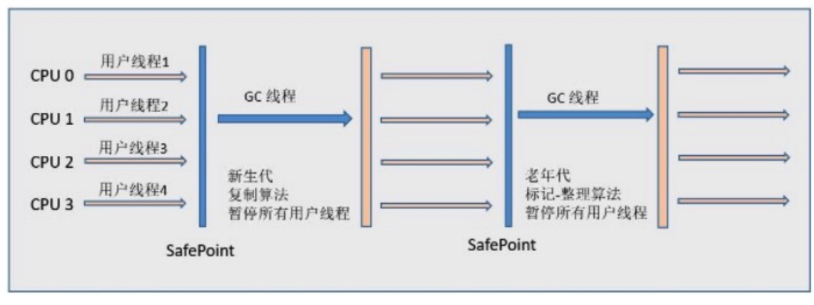
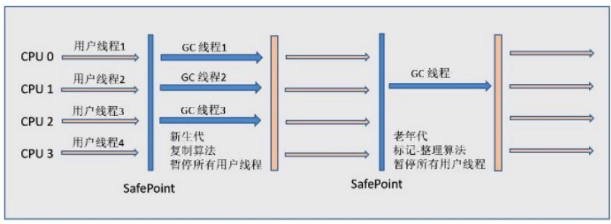
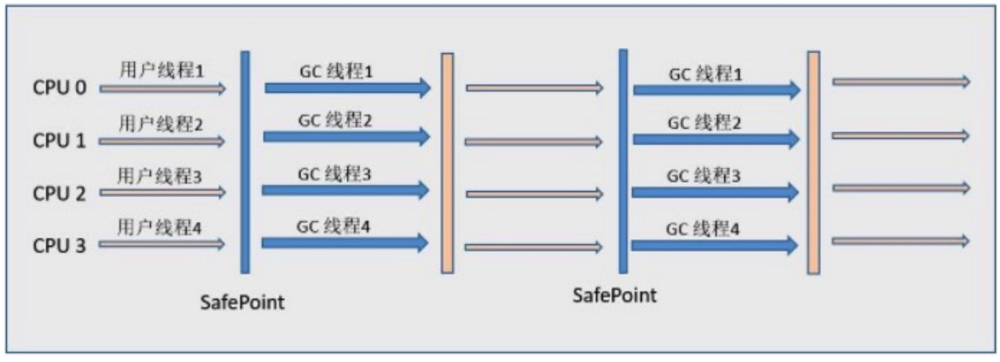
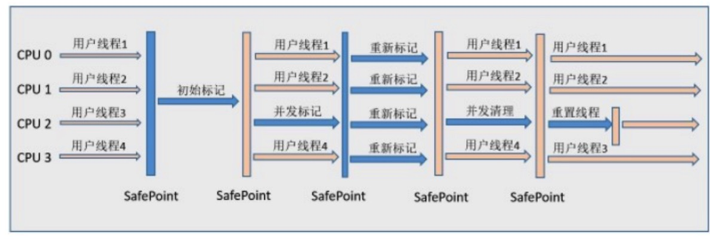
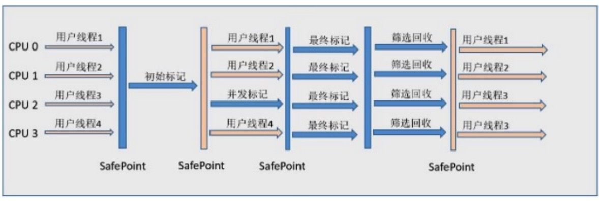
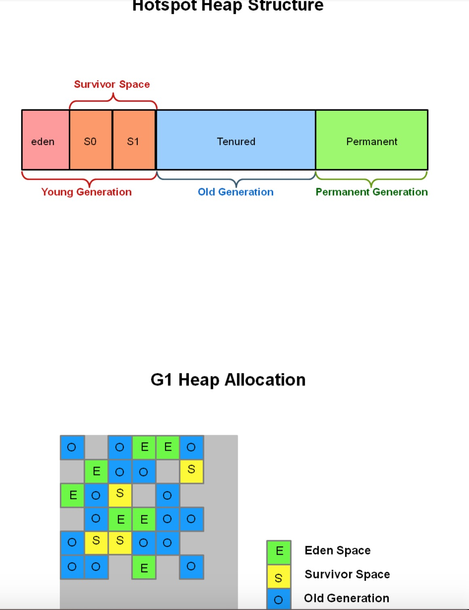

* 目录
{:toc}

# 1 基础

## 1.1 Hotspot Architecture

The main components of the JVM include the class loader, the runtime data areas, and the execution engine.
其中和性能最相关的是紫⾊的三部分。在调整性能时，JVM有三个组件。堆是存储对象数据的位置。然后，此区域由启动时选择的垃圾收集器管理。⼤多数调优选项都与调整堆⼤⼩和为您的情况选择最合适的垃圾收集器有关。 JIT编译器对性能也有很⼤影响，但很少需要使⽤较新版本的JVM进⾏调优。

## 1.2 性能基础

> Typically, when tuning a Java application, the focus is on one of two main goals: responsiveness or throughput. We will refer back to these concepts as the tutorial progresses.

### Responsiveness

Responsiveness refers to how quickly an application or system responds with a requested piece of data. Examples include:

* How quickly a desktop UI responds to an event
* How fast a website returns a page
* How fast a database query is returned

For applications that focus on responsiveness, large pause times are not acceptable. The focus is on responding in short periods of time.

### Throughput

Throughput focuses on maximizing the amount of work by an application in a specific period of time. Examples of how throughput might be measured include:

* The number of transactions completed in a given time.
* The number of jobs that a batch program can complete in an hour.
* The number of database queries that can be completed in an hour.

High pause times are acceptable for applications that focus on throughput. Since high throughput applications focus on benchmarks over longer periods of time, quick response time is not a consideration.

https://www.oracle.com/technetwork/tutorials/tutorials-1876574.html

# 1 垃圾收集基础算法

标记-清除算法（mark-sweep）、复制算法（copying）和标记-整理算法（markcompact）。

| | 描述 | 优缺点 | 适⽤情景
|mark-sweep|先标记所有需要回收的对象，在标记完成后统⼀回收所有被标记的对象|缺点：会产⽣很多不连续的空间碎⽚，所以可能会导致程序运⾏过程中需要分配较⼤的对象的时候，⽆法找到⾜够的内存⽽不得不提前出发⼀次垃圾回收。||
|copying| 将可⽤内存的容量分为⼤⼩相等的两块，每次只使⽤其中的⼀块，当这⼀块内存使⽤完了，就把存活着的对象复制到另外⼀块上⾯，然后再把已使⽤过的内存空间清理掉。|优点：每次都是对整个半区进⾏内存回收，内存分配时也就不⽤考虑内存碎⽚等复杂情况，只要移动堆顶指针，按顺序分配内存即可，实现简单，运⾏⾼效。缺点：算法的代价是将内存缩⼩为了原来的⼀半。|新⽣代|
|mark-compact|与标记-清除算法过程⼀样，只不过在标记后不是对未标记的内存区域进⾏清理，⼆是让所有的存活对象都向⼀端移动，然后清理掉边界外的内存。|优点：解决了内存碎⽚问题。|⽼年代|

# 2 垃圾收集器

## 新生代收集器
### Serial

概念  
基于复制算法的单线程新⽣代垃圾回收器

优点  
简单⽽⾼效（与其他收集器的单线程相⽐），对于限定单个CPU的环境来说，Serial收集器由于没有线程交互的开销，专⼼做垃圾收集⾃然可以获得更⾼的单线程收集效率。

缺点  
速度慢。

下图展示了Serial 收集器（⽼年代采⽤Serial Old收集器）的运⾏过程.

### ParNew 收集器

概念  
ParNew收集器就是Serial收集器的多线程版本。  
ParNew收集器的⼯作过程如下图（⽼年代采⽤Serial Old收集器）.

## Parallel Scavenge 收集器

基于复制算法的并⾏新⽣代回收器，⽬标是吞吐量。

优点：  
适⽤于关注吞吐⽽⾮相应停顿的计算类应⽤。

注意：  
Parallel Scavenge收集器⽆法与CMS收集器配合使⽤。

## ⽼年代垃圾回收器

### Serial old 收集器

概念：  
Serial 的⽼年带版本，基于标记-整理算法的单线程⽼年带回收器。

### Parallel Old收集器

概念：  
Parallel Scavenge 的⽼年带版本，基于标记整理算法的多线程⽼年带回收器，⽬标是吞吐量。
Parallel Scavenge/Parallel Old收集器配合使⽤的流程图.

### CMS收集器

基于标记清除算法的⽼年带回收器，⽬标是最短停顿时间，保证应⽤响应性。

优点：  
并发收集，低停顿。并发标记、并发清除都不需要 stop-the-world。

缺点：  
基于的标记-清除算法产⽣内存碎⽚。
并发对 CPU 消耗⼤。

CMS收集器⼯作的整个流程分为以下4个步骤：

* 初始标记（CMS initial mark）：仅仅只是标记⼀下GC Roots能直接关联到的对象，速度很快，需要“Stop The World”。
* 并发标记（CMS concurrent mark）：进⾏GC Roots Tracing的过程，在整个过程中耗时最⻓。
* 重新标记（CMS remark）：为了修正并发标记期间因⽤户程序继续运作⽽导致标记产⽣变动的那⼀部分对象的标记记录，这个阶段的停顿时间⼀般会⽐初始标记阶段稍⻓⼀些，但远⽐并发标记的时间短。此阶段也需要“Stop The World”。
* 并发清除（CMS concurrent sweep).

### G1

Garbage-First（G1）收集器是⼀种服务器式垃圾收集器，适⽤于具有⼤内存的多处理器机器。它以⾼概率满⾜垃圾收集（GC）暂停时间⽬标，同时实现⾼吞吐量。
Oracle JDK 7 Update 4及更⾼版本完全⽀持G1垃圾收集器。G1收集器专为以下应⽤⽽设计：

* 可以与CMS收集器等应⽤程序线程同时运⾏。
* 紧凑的⾃由空间，没有⻓时间的GC引起的暂停时间
* 需要更多可预测的GC暂停持续时间。
* 不想牺牲很多吞吐量性能。
* 不需要更⼤的Java堆。

G1计划作为Concurrent Mark-Sweep Collector（CMS）的⻓期替代品。将G1与CMS进⾏⽐较，存在差异，使G1成为更好的解决⽅案。⼀个区别是G1是压缩收集
器。G1⾜够紧凑以完全避免使⽤细粒度的⾃由列表进⾏分配，⽽是依赖于区域。这⼤⼤简化了收集器的各个部分，并且主要消除了潜在的碎⽚问题。此外，G1提供⽐CMS收集器更可预测的垃圾收集暂停，并允许⽤户指定所需的暂停⽬标。

G1 对堆区的划分和之前垃圾回收器的区别

G1 使⽤情景推荐：https://www.oracle.com/technetwork/tutorials/tutorials-1876574.html

# 3 垃圾收集调优

定⽅向：关注吞吐还是响应。
从业务特性、虚拟机配置两⽅⾯⼊⼿。

参考:
* https://crowhawk.github.io/2017/08/15/jvm_3/
* https://www.oracle.com/technetwork/cn/articles/java/g1gc-1984535-zhs.html
* https://tech.meituan.com/2016/09/23/g1.html