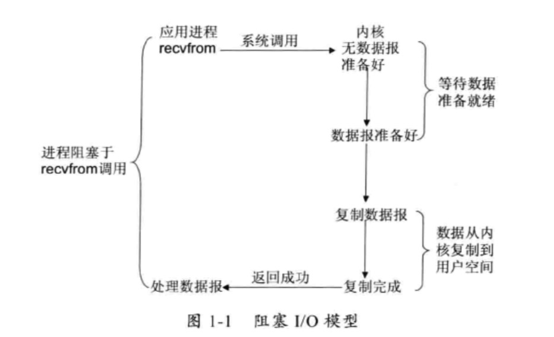
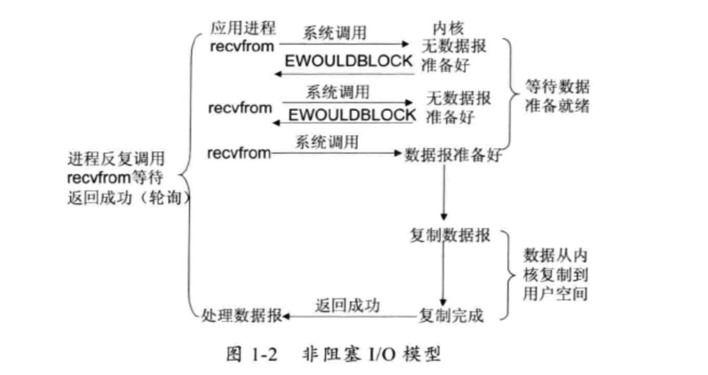
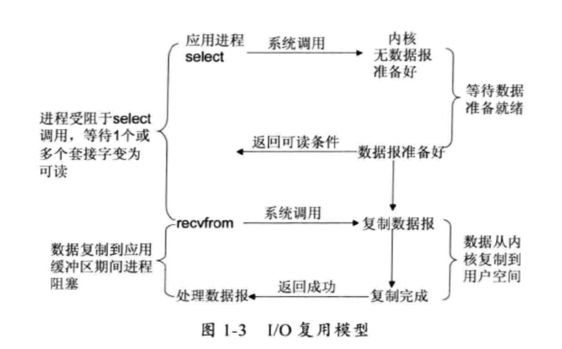
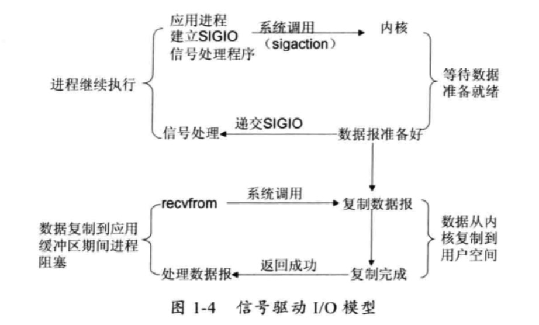
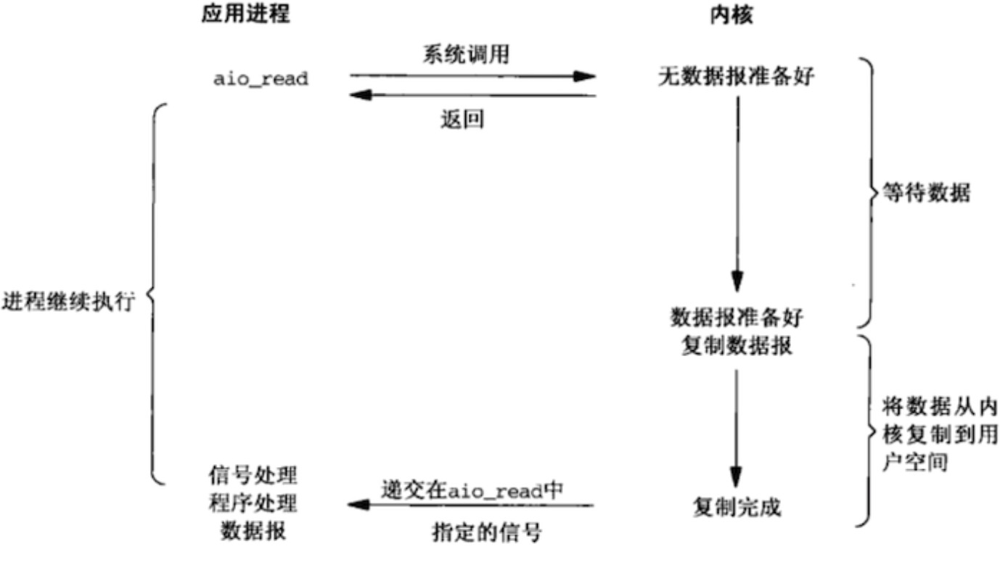
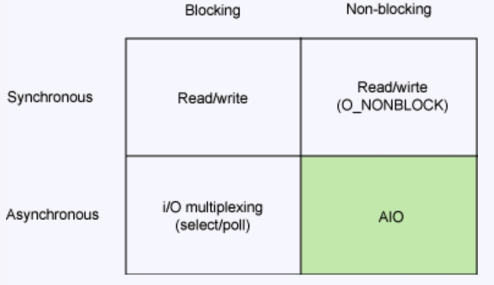

* 目录
{:toc}

## 1 概念

__用户空间和进程空间__

现代操作系统一般都将运行空间划分为两个，用户空间和内核空间。不同的空间，拥有自己的内存地址范围，在32位操作系统中，
一般将最高的1G字节划分为内核空间，供内核使用，而将较低的3G字节划分为用户空间，供各个进程使用。

* http://www.ruanyifeng.com/blog/2016/12/user_space_vs_kernel_space.html。
* https://juejin.im/post/5d69d4075188255d3d29abfd

__用户态 内核态__

应用程序如果运行在用户空间，就叫用户态；如果运行在内核空间，就叫内核态。
用户态的进程不能随意操作内核地址空间。只能通过 __系统调用__ 完成。

* https://drawings.jvns.ca/userspace/
* https://cllc.fun/2019/03/02/linux-user-kernel-space/

__零拷贝__

为了解决用户态到内核态的频繁切换以及用户空间到内核空间的数据频繁复制。

* https://juejin.im/post/5d69d4075188255d3d29abfd   
* https://zhuanlan.zhihu.com/p/66595734

## 2 I/O 模型

####  阻塞 I/O 模型。
阻塞 I/O 阻塞在两个点，一是等待内核态完成I/O请求，此时请求结果存储在内核空间。二是结果从内核
空间拷贝到用户空间过程的阻塞等待。整个过程的系统调用为 recvfrom。

#### 非阻塞 I/O 模型。
和阻塞 I/O 相比，非阻塞 I/O 在执行 recvfrom 系统调用时，如果未完成请求，即在内核空间无数据，那么立刻返回
错误，而不是一直等待内核态完成请求。当内核空间数据报文准备好，并收到 revcfrom 系统调用后，会将结果从内和空间
拷贝到用户空间，此过程仍然是阻塞的。

#### 多路复用 I/O。
注意多路复用并不是指 I/O 端口复用，而是指将多个 I/O 阻塞复用到同一个 select 阻塞上。此技术基于操作系统提供的
select/poll/epoll 等系统调用（其中 epoll 基于事件驱动且无socket 描述符数量限制等问题，较 select 更优）。
和 I/O 多路复用对比的是使用多线程处理多个I/O 阻塞操作，相比此种形式，
多路复用模型节省了多线程的带来的系统开销。

#### 信号驱动 I/O 模型。

#### 异步 I/O 模型。

应用进程发起aio_read系统调用后，该系统调用立即返回。然后内核会自己等待数据ready，
并自动将数据拷贝到用户内存。整个过程完成以后，内核会给用户进程发送一个信号，通知IO操作已完成。

## 3 总结

从同步/异步，阻塞/非阻塞这两个维度来衡量几种 IO 模型，它们的映射如下。

需要注意的是，I/O 模型是底层操作系统定义并支持的，但是理解 IO 模型才能更清楚的理解网络库。
IO 模型的高效以及系统支持是 Netty 高性能的基础，但是在 IO 模型的应用上，Netty 和 JDK nio 实现并无本质区别。