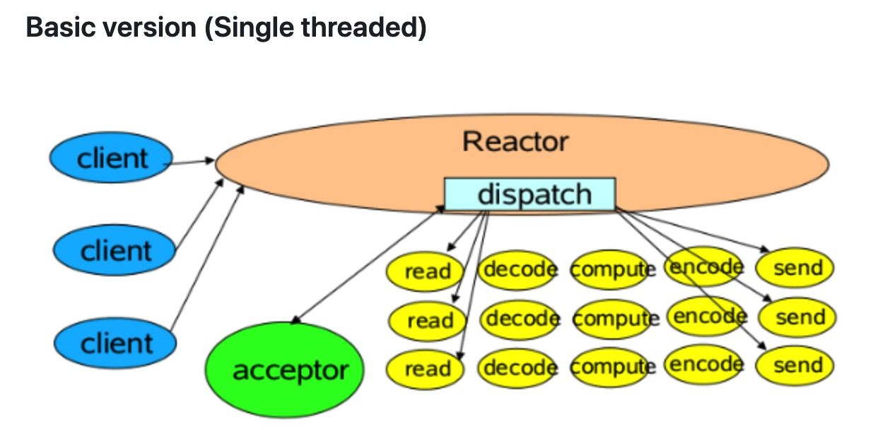
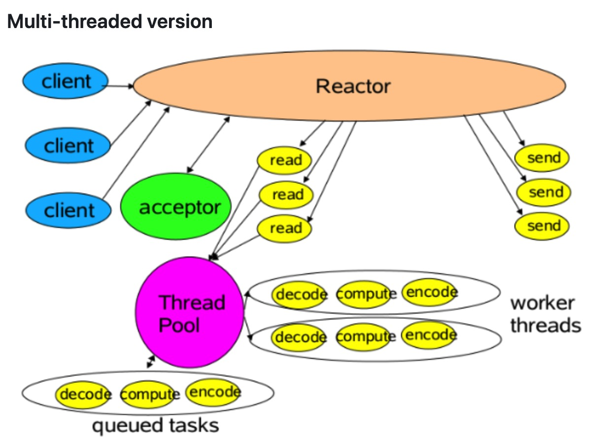
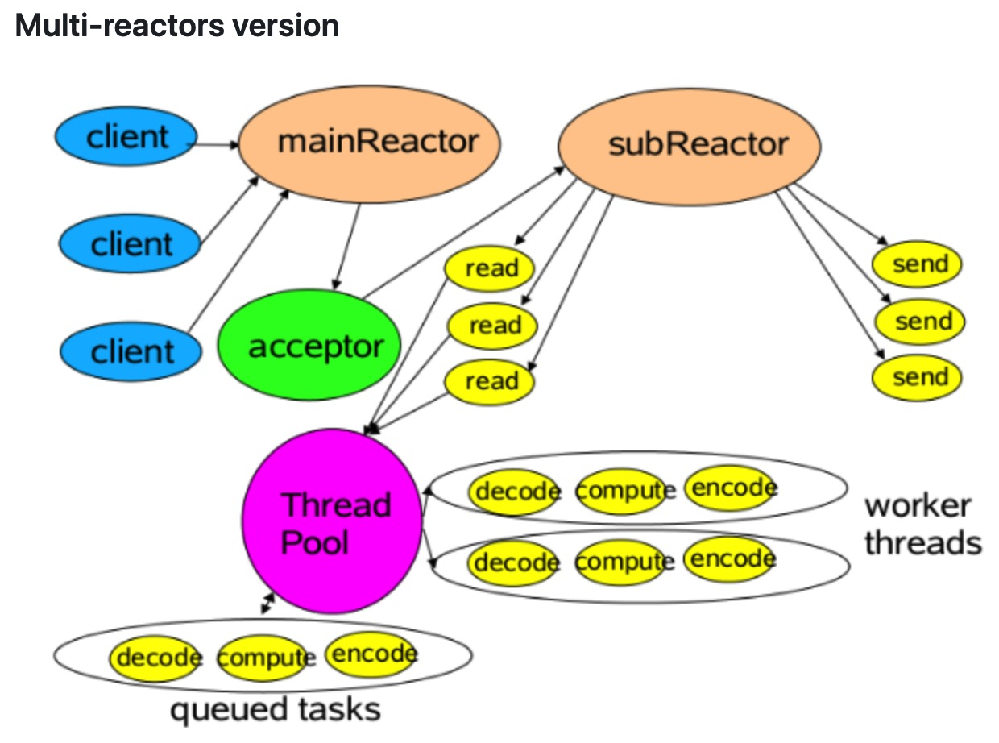
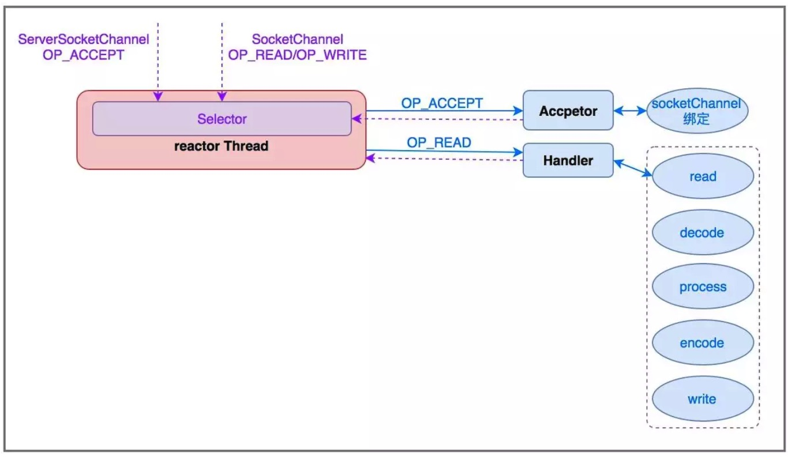
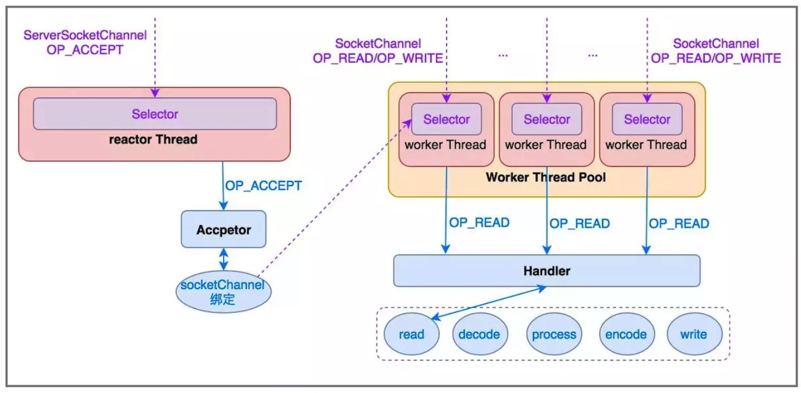
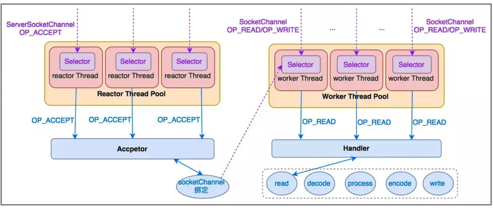

* 目录
{:toc}

# 1 响应式编程 Reactive Programming

和函数式编程一样，响应式编程同样是一种编程范式。
[响应式宣言（Reactive Manifesto)](https://www.reactivemanifesto.org/) 描述了响应式系统（reactive systems）
应该具备的四个关键属性：Responsive（灵敏的）、Resilient（可故障恢复的）、Elastic（可伸缩的）、Message Driven（消息驱动的）。

>* Responsive（灵敏的）：只要有可能，系统就会及时响应。灵敏性是系统可用性的基石，除此之外，灵敏性也意味着系统的问题可以被快速地探测和解决。具有灵敏性的系统关注做出快速和一致的响应，提供可靠和一致的服务质量。
>* Resilient（可故障恢复的）：在出现故障时，系统仍然可以保持响应。一个不具可恢复性的系统一旦出现故障，就会变得无法正常响应。可恢复性可以通过复制、围控、隔离和委派等方式实现。在可恢复性的系统中，故障被包含在每个组件中，各组件之间相互隔离，从而允许系统的某些部分出故障并且在不连累整个系统的前提下进行恢复。
>* Elastic（可伸缩的）：在不同的工作负载下，系统保持响应。系统可以根据输入的工作负载，动态地增加或减少系统使用的资源。这意味着系统在设计上可以通过分片、复制等途径来动态申请系统资源并进行负载均衡，从而去中心化，避免节点瓶颈。
>* Message Driven（消息驱动的）：响应式系统依赖异步消息传递机制，从而在组件之间建立边界，这些边界可以保证组件之间的松耦合、隔离性、位置透明性，还提供了以消息的形式把故障委派出去的手段。

# 2 Reactor 模型

在 Doug Lea 的 [Scalable IO in Java](http://gee.cs.oswego.edu/dl/cpjslides/nio.pdf) 中将 Reactor 模型抽象为三种，分别是：Basic version, Multi-threaded version 和 Multi-reactors version。

## 2.1 Basic version (Single threaded)

所有的 I/O 操作都在同一个 NIO 线程上面完成。
NIO 线程既负责监听多路 socket 并 Accept 新连接，又负责分派、处理请求。
对于一些小容量应用场景，可以使用单线程模型，但是对于高负载、大并发的应用却不合适。实际当中基本不会采用单线程模型。

## 2.2 Multi-threaded version

多线程模型中有一个专门的线程负责监听和处理所有的客户端连接，网络 IO 操作由一个 NIO 线程池负责，它包含一个任务队列和 N 个可用的线程，由这些 NIO 线程负责消息的读取、解码、编码和发送。1个 NIO 线程可以同时处理 N 条链路，但是1个链路只对应1个 NIO 线程，防止发生并发操作问题。
在绝大多数场景下，Reactor 多线程模型都可以满足性能需求。但是在更高并发连接的场景（如百万客户端并发连接），它的性能似乎不能满足需求，于是便出现了下面的多 Reactor（主从 Reactor）模型。

## 2.3 Multi-reactors version

此种又叫做主从 reactor 模型。

这种模型是将 Reactor 分成两部分，mainReactor 负责监听 server socket、accept 新连接，并将建立的 socket 分派给 subReactor；subReactor 负责多路分离已连接的 socket，读写网络数据；而对业务处理的功能，交给 worker 线程池来完成。

## 2.4 另一种描述形式

# 3 Netty 模型

在 Netty 中，可以根据情景使用 BootStrap 和 EventLoopGroup 实现上面不同的 Reactor 模型。

# 4 参考

* [反应式编程概览](https://github.com/ZhongyangMA/webflux-streaming-demo/wiki/%E5%8F%8D%E5%BA%94%E5%BC%8F%E7%BC%96%E7%A8%8B%E6%A6%82%E8%A7%88%EF%BC%88%E4%B8%AD%E6%96%87%E7%89%88%EF%BC%89)