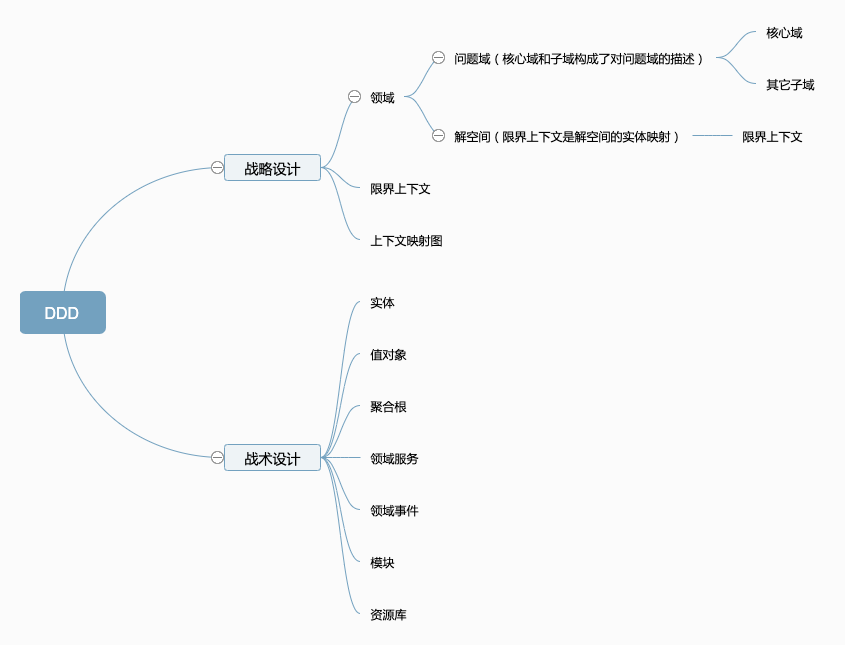
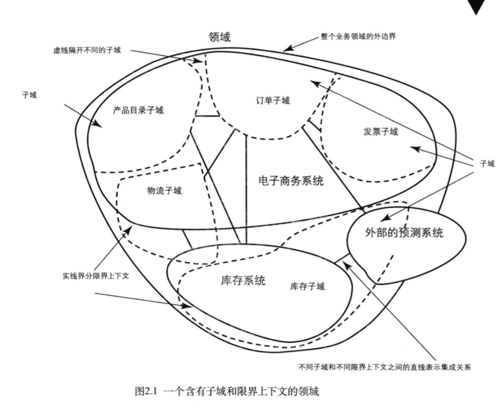
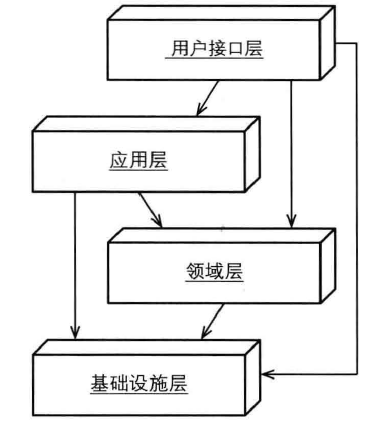
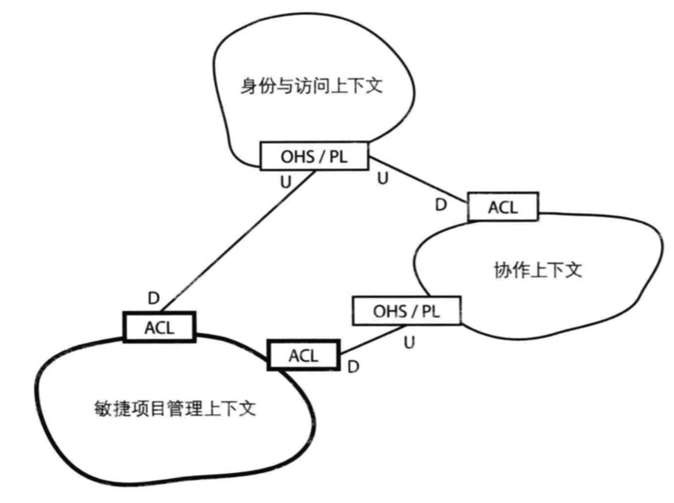

* 目录
{:toc}

## 1 概念、价值与挑战

DDD，领域驱动设计，一种软件设计方法，目标是将复杂业务转化为高质量的软件模型。了解 DDD 的价值是让你有更好的方法去建模业务
模型且基于此实现高质量的软件架构与实现。（清晰的业务模型与清晰的软件实现）

DDD 本身的门槛是包含大量概念术语，需要使用者充分了解。而 DDD 应用在业务上的挑战是需要使用者：

* 不断思考业务领域。
* 研究概念和术语。
* 与领域专家沟通。

在领域驱动方面有两本书 [领域驱动设计 : 软件核心复杂性应对之道](https://book.douban.com/subject/5344973/) 与 [实现领域驱动设计](https://book.douban.com/subject/25844633/)。前者是先驱，但是比较奥涩难懂。后者的概念和主线都比较清晰，适合阅读。

## 2 概念

DDD 的整体概念大概由下面几部分组成：

如下是一个 ddd 整体视角的例子。

#### 领域

> 现实世界中，领域包含了问题域和解系统。一般认为软件是对现实世界的部分模拟。在DDD中，解系统可以映射为一个个限界上下文，限界上下文就是软件对于问题域的一个特定的、有限的解决方案。

#### 限界上下文

在「实现领域驱动设计」中，将限界上下文定义为：
一个由显示边界限定的特定职责。领域模型便存在于这个边界之内。在边界内，每一个模型概念，包括它的属性和操作，都具有特殊的含义。

需要注意的是，限界上下文不仅包含上方所描述的领域模型，在物理层面，限界上下文映射的是「一个系统、一个应用、一个业务服务」。

以下方描述的分层架构为例，架构中的四层都包含在限界上下文中，除非架构中的某一部分是由其它团队设计或维护的（在组织结构层面划分）。

[

#### 上下文集成 & 上下文映射图

一个限界上下文通常就是一个领域/子域的解空间（解决方案）。限界上下文不是孤立的，多个限界上下文的交互即上下文集成，各个上下文的关系通过上下文映射图描述。

限界上下文的关系包含：

* 合作关系（Partnership）：两个上下文紧密合作的关系，一荣俱荣，一损俱损。
* 共享内核（Shared Kernel）：两个上下文依赖部分共享的模型。
* 客户方-供应方开发（Customer-Supplier Development）：上下文之间有组织的上下游依赖。
* 遵奉者（Conformist）：下游上下文只能盲目依赖上游上下文。
* 防腐层（Anticorruption Layer）：一个上下文通过一些适配和转换与另一个上下文交互。
* 开放主机服务（Open Host Service）：定义一种协议来让其他上下文来对本上下文进行访问。
* 发布语言（Published Language）：通常与OHS一起使用，用于定义开放主机的协议。
* 大泥球（Big Ball of Mud）：混杂在一起的上下文关系，边界不清晰。
* 另谋他路（SeparateWay）：两个完全没有任何联系的上下文。

上图是一个上下文映射图的例子。

#### 实体

实体具有唯一 ID 标识，在实体的生命周期中，实体值会不断变化。总结来说，实体具有两个特性：

1. 唯一标识。
2. 可变性。因为具有唯一标识，所以即使实体其它属性发生变化，实体仍然是当前实体（ID 不变）。

这两个特性也是实体与值对象的根本区别。
实体不仅包含属性，还包含行为（不是属性的 getter setter）。单包含属性的模型被称为「贫血模型」，无法做到内聚。行为包含多种，如 valid check 这种资源校验也是一种行为，同样应该包含在模型中。

实体是不断变化的，可以使用「领域事件」传播并跟踪实体的变化。

#### 值对象

值对象用于度量和描述事物，值对象具有不变性、相等性和可替换性。不变是指值对象本身不变，当值对象描述的事物发生变化时，可以使用另一个值对象替代。相等性是指值对象可以和其它值对象进行相等性比较。

当判断模型是否为值对象时，应该尝试看其是否符合值对象的三个特性。典型的值对象应用的例子：

1. 用值对象标识标准模型，如货币类型，CurrencyType 可以是 USD/RMB 等。
2. 用值对象作为限界上下文交互参数。因为其具有不变性。

#### 聚合根

聚合由根实体，值对象和实体组成。聚合是一组相关对象的集合，作为一个整体被外界访问，聚合根（Aggregate Root）是这个聚合的根节点。

聚合根的设计具有如下指导原则：

1. 边界内的内容具有一致性：在一个事务中只修改一个聚合实例。如果你发现边界内很难接受强一致，不管是出于性能或产品需求的考虑，应该考虑剥离出独立的聚合，采用最终一致的方式。
2. 设计小聚合：大部分的聚合都可以只包含根实体，而无需包含其他实体。即使一定要包含，可以考虑将其创建为值对象。
3. 通过唯一标识来引用其他聚合或实体：当存在对象之间的关联时，建议引用其唯一标识而非引用其整体对象。如果是外部上下文中的实体，引用其唯一标识或将需要的属性构造值对象。 如果聚合创建复杂，推荐使用工厂方法来屏蔽内部复杂的创建逻辑。

聚合内部多个组成对象的关系可以用来指导数据库创建。

#### 领域服务

领域服务是无状态的操作，用于实现领域中的任务。当某个操作不适合放在聚合或者值对象中时，可以考虑使用领域服务。

领域服务不是我们通常说的物理层面的服务/应用，也不是分层架构中的应用层。下面的操作适合由领域服务完成：

* 执行一个显著的业务操作流程。
* 对领域对象进行转换。
* 对多个领域对象作为输入进行计算，产生一个值对象。如输入是多个聚合，那么这段计算放在任何一个聚合中都不合适，此时应该使用领域对象。

注意：

* 不要滥用领域服务，可能导致被操作的领域模型编程贫血模型。
* 领域服务并不是应用服务，不是分层架构中的应用层。在领域服务中只包含领域相关操作，而不包含如事务等领域无关操作，这些操作应该在应用层中。

#### 领域事件

领域事件是对领域内发生的活动进行的建模。可以使用领域事件传播并跟踪实体的变化。

#### 模块

模块是一种利用代码形式控制限界上下文的手段。如限界上下文 xxx 可以用 `com.prefix.suffix.xxx` 模块路径表示，其包含的内部概念可以用 `com.prefix.suffix.xxx.domain.entity`、`com.prefix.suffix.xxx.domain.service` 等形式表示。

## 3 流程

在 DDD 实施流程上，整体分为两步：战略设计与战术设计。战略设计是定义领域、划分子域并制定限界上下文。而实体、值对象等梳理与实现等细节包含在战术设计中。

在参考[1]中，将 DDD 划分为下面几步。
>
1. 根据需求划分出初步的领域和限界上下文，以及上下文之间的关系；
2. 进一步分析每个上下文内部，识别出哪些是实体，哪些是值对象；
3. 对实体、值对象进行关联和聚合，划分出聚合的范畴和聚合根；
4. 为聚合根设计仓储，并思考实体或值对象的创建方式；
5. 在工程中实践领域模型，并在实践中检验模型的合理性，倒推模型中不足的地方并重构。

一个很好的例子，可见 [领域驱动设计在互联网业务开发中的实践](https://tech.meituan.com/2017/12/22/ddd-in-practice.html)。

## 4 最佳实践

1. 不要使用静态方法。而应该在使用领域模型中的行为方法。
2. 规避贫血模型。

## 4 参考

1. [领域驱动设计在互联网业务开发中的实践](https://tech.meituan.com/2017/12/22/ddd-in-practice.html)