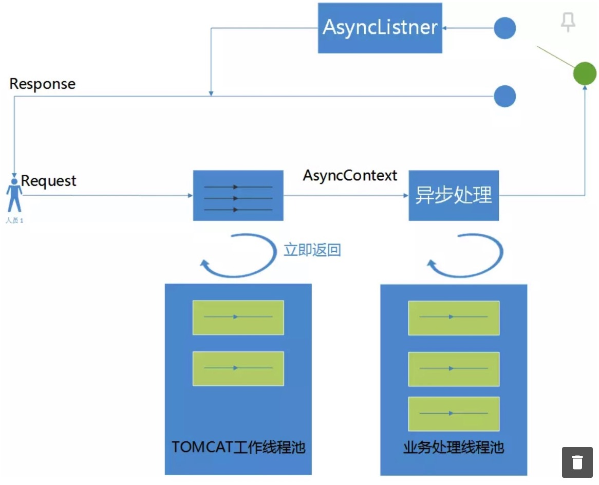

* 目录
{:toc}


客户端服务端通信有两种形式，推和拉（push & pull），实时通信在普通通信的基础上要求服务端的更新以最快的速度被客户端感知，

其实现形式一般有：

1. 轮询。
2. 长轮询。
3. 长连接。

## 短轮询

短轮询即客户端向服务端发送http请求，服务器端在收到请求后，不论是否有数据更新，都直接进行响应。其优点是流程和实现都比较简单。
但扩展性问题比较明显，当客户端不断增加时，服务端需要不断扩容以响应实时请求。并且服务端压力和客户端希望的实时性成正比，如
客户端希望能够秒级获取实时数据，那么需要以1次每秒的速度请求服务端。而有效请求很少，浪费客户端和服务端资源。

可以使用 HTTP Client/Server 形式实现此种方案。

## 长轮询

当服务器收到客户端发来的请求后,服务器端不会直接进行响应，而是先将这个请求挂起，然后判断服务器端数据是否有更新。如果有更新，
则进行响应，如果一直没有数据，则到达一定的时间限制(服务器端设置)才返回。

长轮询通过延时响应、请求挂起的方式大大减少了无效请求，进而尽量规避短轮询资源浪费问题。但是在服务端将
请求挂起会严重浪费优先的 Web 服务器线程，降低服务器并发能力。如服务器线程180个，每个长轮询挂起6秒，那么最好情况下服务
器处理请求的并发数为 30 个，且并发能力会随着挂起时间增加而不断降低。

为了解决这种为题，servlet 3.x 版本支持了请求异步化，即请求立即返回（不是返回给客户端）并释放服务器线程，且当请求真正
完成后才真正返回给客户端。针对这种实现可参考 [Long Polling长轮询实现进阶](https://www.jianshu.com/p/6e90c2f2e463)。

<p style="text-align:center">

</p>

但是实际上服务端大部分都使用 Spring 框架，Spring 同样封装了 DefferResult 来支持这种服务端异步化。具体实现可见下面
的例子。

#### 客户端

```java
@Slf4j
public class Client {

    private static RequestConfig requestConfig = RequestConfig.custom()
            .setConnectTimeout(1000)
            .setConnectionRequestTimeout(100)
            // 长轮询超时时间
            .setSocketTimeout(5 * 1000)
            .build();

    private static CloseableHttpClient httpClient = HttpClients.custom()
            .setMaxConnPerRoute(3)
            .setMaxConnTotal(21)
            .setDefaultRequestConfig(requestConfig)
            .build();

    private static String ID = "100";

    public static void main(String[] args) throws Exception {

        URIBuilder longPollingUriBuilder = new URIBuilder();
        longPollingUriBuilder.setScheme("http")
                .setHost("localhost")
                .setPort(8080)
                .setPath("/longpolling")
                .setParameter("id", ID);

        // 长轮询请求，会超时
        request(longPollingUriBuilder);

        // 第二次长轮询请求
        request(longPollingUriBuilder);

        URIBuilder changeValueUriBuilder = new URIBuilder();
        changeValueUriBuilder.setScheme("http")
                .setHost("localhost")
                .setPort(8080)
                .setPath("/changevalue")
                .setParameter("id", ID)
                .setParameter("value", "100");
        CompletableFuture.runAsync(() -> request(longPollingUriBuilder));
        Thread.sleep(2 * 1000);

        // 模拟长轮询请求超时前更新服务端数据
        request(changeValueUriBuilder);
    }

    private static void request(URIBuilder uriBuilder)  {
        HttpGet httpGet = null;
        try {
            httpGet = new HttpGet(uriBuilder.build());
        } catch (URISyntaxException e) {
            log.error("", e);
        }

        Stopwatch stopwatch = Stopwatch.createStarted();
        try (CloseableHttpResponse httpResponse = httpClient.execute(httpGet)) {
            // 确保 consume
            String responseString = EntityUtils.toString(httpResponse.getEntity());

            log.info("响应：{}, 耗时:{} ms", responseString, stopwatch.elapsed(TimeUnit.MILLISECONDS));

        } catch (IOException e) {
            log.error("exception.", e);
        }
    }
}
```

#### 服务端

```java
@RestController
@Slf4j
public class Server {


    private static final Object NO_RESULT = "NoResult";
    private Map<String, DeferredResult<String>> watchedKeys =
            new HashMap<>(8);

    @RequestMapping(path = "/longpolling", method = RequestMethod.GET)
    public DeferredResult<String> longPolling(@RequestParam(name = "id") String id) {

        log.info("request param:{}, current watch keys:{}", id, watchedKeys);

        watchedKeys.computeIfAbsent(id,
                p -> {
                    log.info("create deffer result.");
                    // 设置 DeferredResult 超时时间，即超过配置的时间仍然无结果(未调用 DefferResult#setResult)
                    // 会走 onTimeout 逻辑。
                    DeferredResult<String> deferredResult = new DeferredResult(Long.valueOf(4 * 1000));
                    deferredResult.onCompletion(() -> {

                        log.info("completion");
                        watchedKeys.remove(p);
                    });
                     // 异常 callback, 注意此 callback 调用后框架会默认执行  onCompletion callback
                    deferredResult.onError(throwable -> {
                                log.info("error");
                                deferredResult.setErrorResult("--error--");
                            }
                    );
                    // 超时callback, 注意此 callback 调用后框架会默认执行  onCompletion callback
                    deferredResult.onTimeout(() -> {
                        log.info("timeout");
                        deferredResult.setErrorResult("--timeout--");

                    });
                    return deferredResult;
                });
        log.info("current watch keys:{}", watchedKeys);
        return watchedKeys.get(id);
    }


    // 模拟数据更新
    @RequestMapping(path = "/changevalue")
    private String changeValue(@RequestParam(name = "id") String id,
                               @RequestParam(name = "value") String value) {

        log.info("change value, id:{}, value:{}", id, value);
        log.info("current watch keys:{}", watchedKeys);

        watchedKeys.get(id).setResult(value);
        return "Change value success.";
    }

}

```

## 长连接

长轮询本质上仍是 pull 形式，整个过程由客户端发起。但是长连接则不同，在客户端服务端建立连接后，服务端在感知到数据更新后
可以主动 push 给客户端，在实时性方面最佳，且无需客户端多次发起轮询请求，资源浪费最少。

长连接可以使用 Netty 模拟。客户端和普通无区别，下面看下服务端实现形式。

启动类

```java
@Slf4j
public class NettyServer {

    private static EventLoopGroup boss = Epoll.isAvailable() ?
            new EpollEventLoopGroup(4, new NamedThreadFactory("netty-epoll-boss")) :
            new NioEventLoopGroup(4, new NamedThreadFactory("netty-nio-boss"));

    private static EventLoopGroup worker = Epoll.isAvailable() ?
            new EpollEventLoopGroup(0, new NamedThreadFactory("netty-epoll-worker")) :
            new NioEventLoopGroup(0, new NamedThreadFactory("netty-nio-worker"));


    private int serverPort;
    private ServerBootstrap serverBootstrap;
    private Channel channel;
    public static Channel clientChannel;

    public NettyServer(int serverPort) {

        this.serverPort = serverPort;
        serverBootstrap = new ServerBootstrap();

        // 配置 boot strap
        serverBootstrap.group(boss, worker)
                .channel(Epoll.isAvailable() ? EpollServerSocketChannel.class : NioServerSocketChannel.class)
                .option(ChannelOption.SO_BACKLOG, 1024)
                .option(ChannelOption.SO_REUSEADDR, true)
                .childHandler(new NettyServerInitializer());


        try {
            ChannelFuture channelFuture = serverBootstrap.bind(serverPort).sync();
            channel = channelFuture.channel();
        } catch (InterruptedException e) {

            log.error("server init exception", e);
            boss.shutdownGracefully();
            worker.shutdownGracefully();
        } finally {
        }
    }


    public void push(String message) {
        RpcContext response = new RpcContext();
        byte[] content = HessianSerializer.serialize(new Response(1, message));
        response.setContent(content);
        response.setSequence(0);
        response.setType(Response.class);

        ChannelFuture future = null;
        future = clientChannel.writeAndFlush(response);
//        log.info("result:{}", future.isDone() && future.isSuccess());

    }
}
```

其中 clientChannel 在连接建立时获取并赋值，如：

```java
@Slf4j
public class ServerHandler extends SimpleChannelInboundHandler<RpcContext>{


    @Override
    protected void channelRead0(ChannelHandlerContext ctx, RpcContext msg) throws Exception {

        log.info("[ServerHandler] start.");
        byte[] paramBytes = msg.getContent();
        Object param = HessianSerializer.deserialize(paramBytes, msg.getType());

        log.info("[ServerHandler] msg:{}", msg);

        Response result = ServerRegistry.getINSTANCE().get().test((RequestParam) param);

        RpcContext response = new RpcContext();
        byte[] content = HessianSerializer.serialize(result);
        response.setContent(content);
        response.setSequence(msg.getSequence());
        response.setType(Response.class);

        ctx.writeAndFlush(response);

    }

    @Override
    public void channelActive(ChannelHandlerContext ctx) throws Exception {
        NettyServer.clientChannel = ctx.channel();
        super.channelActive(ctx);
    }
}
```

## 总结

以上即为后端实时通信的基本思路，如配置中心客户端实时更新等情景都可以采用上面方式，其中携程开源配置中心 Apollo 使用的方式
为长轮询。