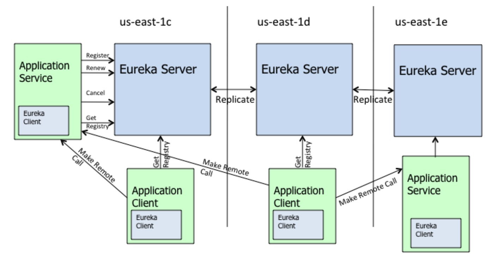

* 目录
{:toc}

## 1 概述
说到服务发现，一般会想起微服务，因为微服务的集群化、动态变更频率高，所以必须提供一种机制，
使得服务消费者在服务提供者的网络位置发生变化时，能够及时获得最新的位置信息，
一般是提供一个网络位置稳定的服务注册中心，服务提供者的网络位置被注册到注册中心，
并在网络位置发生变化的时候及时更新，而服务消费者定期向注册中心获取服务提供者的最新位置信息，
这就是最基本的服务发现机制。

伴随服务发现，一般会提起 CAP，且当前普遍认为服务发现系统应是 AP 而不是 CP 系统。
在这个维度上，主流的服务发现产品的对比一般如下。

[主流微服务注册中心浅析和对比](https://zhuanlan.zhihu.com/p/63263168)
这个图中也呈现了在服务发现技术选型或者设计中关注的主要技术点。除此之外，一致性算法也是主要关注点，如 ZK 基于
Paxos，Consul 基于 Raft 等。

## 2 Eureka

以 Eureka 实现为例，了解其中的关键概念。

Eureka 的物理架构如下

从几个问题出发，看下 Eureka 实现。

__Eureka 架构中角色都包含？__

从架构图中可见，三个组成部分，Eureka Server, Eureka Client(Application Service/Application Client)。

__服务注册与发现机制？（Eureka Client 和 Eureka Server 交互行为？）__

Eureka Client 和 Server 之间的交互是单向的，行为包含：
1. Registering。向 Server 注册实例。
2. Renewal。向 Server 更新租约（注册信息）。通过心跳。
3. Cancellation。取消租约。
4. Querying。查询服务列表。

其中 1、2、3 即服务注册机制。而 4 则为服务发现机制。

__Eureka Server 一致性保证？__

Eureka 定位是 AP 系统，Client 向 Server 进行服务注册后，Server 根据配置的 Service Url 向其它所有 Server 
同步状态变更信息。具体实现在 PeerAwareInstanceRegistry#replicateToPeers 中。

__Eureka Server 最新状态保证？__

服务端的最新状态依靠客户端的上报行为，包含注册、取消以及心跳。除此之外，Server 内部还会启动定时任务不断 check 过期的 Client，并
刷新服务列表。

__Eureka Client 最新状态保证？__

定时从服务端拉取。

__整体行为描述？__

> Services register with Eureka and then send heartbeats to renew their leases every 30 seconds. If the client cannot renew the lease for a few times, it is taken out of the server registry in about 90 seconds. The registration information and the renewals are replicated to all the eureka nodes in the cluster. The clients from any zone can look up the registry information (happens every 30 seconds) to locate their services (which could be in any zone) and make remote calls.

__缓存机制？__

Eureka 客户端和服务端都有缓存机制，作为对方不可用或者短时间无法通信情景的 backup。

关于可用性，官方文档描述为：
> Eureka clients are built to handle the failure of one or more Eureka servers. Since Eureka clients have the registry cache information in them, they can operate reasonably well, even when all of the eureka servers go down.
  Eureka Servers are resilient to other eureka peers going down. Even during a network partition between the clients and servers, the servers have built-in resiliency to prevent a large scale outage.

## 3 总结

整体来说，全局交互基于 Client->Server 模式，没有服务端通知机制，这保证了交互的简单化。通过主动通知与定时更新方式保证数据一致性。
服务端使用 Peer to Peer 方式保持整体注册数据的一致性，足够简单，但是不够动态化（如 ElasticSearch 的 Zen 机制，可以动态感知服务端变更）。
基于缓存和大范围变更延迟化行为保证可用性。

## 4 参考

* https://github.com/Netflix/eureka/wiki/Eureka-at-a-glance
* [聊聊微服务的服务注册与发现](http://jm.taobao.org/2018/06/26/%E8%81%8A%E8%81%8A%E5%BE%AE%E6%9C%8D%E5%8A%A1%E7%9A%84%E6%9C%8D%E5%8A%A1%E6%B3%A8%E5%86%8C%E4%B8%8E%E5%8F%91%E7%8E%B0/)
* [主流微服务注册中心浅析和对比](https://zhuanlan.zhihu.com/p/63263168)
* http://blueskykong.com/2019/09/22/eureka-client/
* [Spring Cloud Eureka 全解 ](https://zhuanlan.zhihu.com/p/34976419)